## Операционные системы UNIX/Linux (Базовый).

## Part 1. Установка ОС

- Система установлена

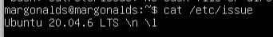

## Part 2. Создание пользователя

- Создание нового пользователя.
- Добавление пользователя в группу adm
    - a означает "append"/"добавить", что указывает на то, что надо добавить пользователя в указанную группу, а не заменять его текущие группы на adm

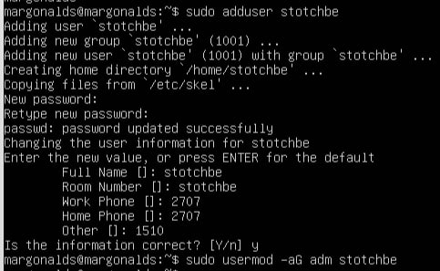

- Новый пользователь в выводе команды

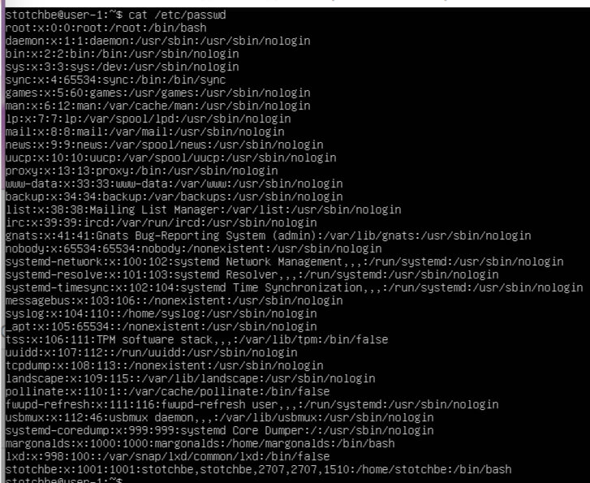

## Part 3. Настройка сети ОС

1) Изменение имени машины `sudo hostnamectl set-hostname user-1` (ctl является сокрыщением слова "control", что указывает на то, что эта команда используется для управления)

2) Установка временной зоны `sudo timedatectl set-timezone Europe/Moscow` и вывод 

3) Вывод названия сетевых интерфейсов с помощью консольной команды `ip link show`

  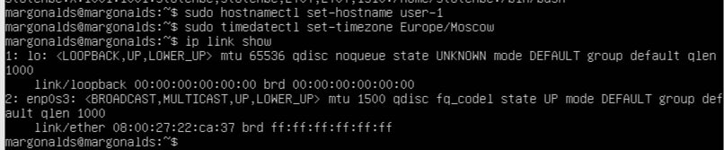
 
 вывод текущего времени 

  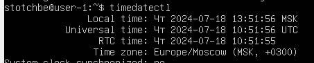

Интерфейс lo, также известный как loopback интерфейс, всегда присутствует при выполнении команды ip link show по нескольким причинам. Прежде всего, он служит для локальных соединений внутри системы, позволяя приложениям и службам взаимодействовать друг с другом без необходимости использования внешней сети. Интерфейс lo позволяет отправлять сетевые запросы на себя, что полезно для тестирования и диагностики сетевых приложений и служб. Любые данные, отправленные на этот интерфейс, никогда не покидают систему, что делает его безопасным для локального использования. 

4) Получение ip устройства от DHCP сервера

  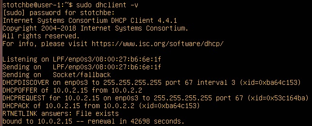

DHCP (Dynamic Host Configuration Protocol) — это сетевой протокол, используемый для автоматического назначения IP-адресов и других параметров сетевых настроек устройствам в сети. Основными аспектами работы DHCP являются автоматическое назначение IP-адресов, настройка сетевых параметров, динамическое и центральное управление.

5) Внешний и внутренний ip адрес шлюза

    - ip route - выводит таблицу маршрутизации сети (как пакеты должны направляться через сеть)
    - grep default - фильтрует таблицу маршрутизации, чтобы показать только строку с маршрутом по умолчанию \

    - curl - передача данных с сервера или на сервер
    - -s - флаг подавляет прогресс и сообщения об ошибках (silent)

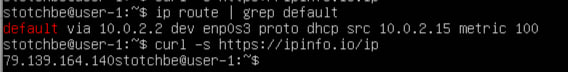

6) Задание статичных настроек ip, gw, dns

  Меняем содержимое файла открыв файл в nano с помощью команды `sudo nano /etc/netplan/01-netcfg.yaml`

  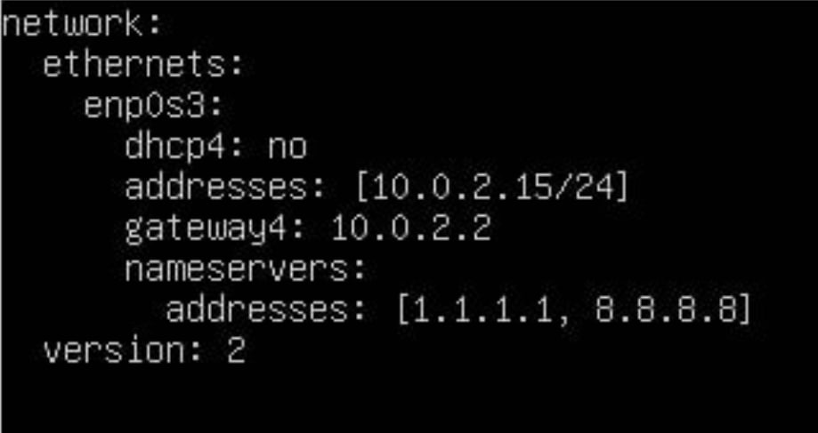

    - enp0s3 - имя сетевого интерфеса
    - 10.0.2.15/24 - статический IP-адрес и маска подсети
    - 10.0.2.2 - шлюз по умолчанию
    - 1.1.1.1 и 8.8.8.8 - публичные DNS серверы

  `sudo netplan apply` применяет изменения в файле

7) Проверка статичных настроек после перезагрузки 

  
  
  Пингование удаленных хостов 1.1.1.1 и ya.ru на основе отправки 4 пакетов прошло успешно.

    - с 4 - колиичество запросов, которые нужно отправить (в данном случае 4)

  - Ping 1.1.1.1

  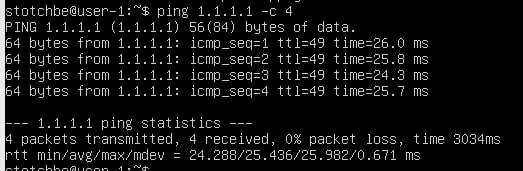

  - Ping ya.ru

  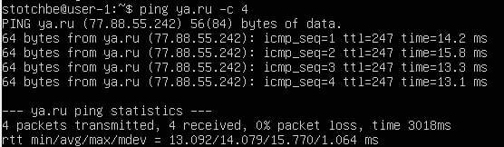

  
## Part 4. Обновление ОС

Для обновления системных пакетов используем команду  `sudo apt update && sudo apt upgrade`

После повторного введения команды получим следующий результат:

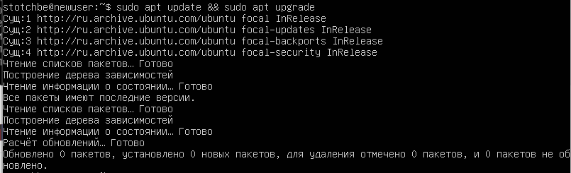

## Part 5. Использование команды **sudo**

##### Разрешить пользователю, созданному в [Part 2](#part-2-создание-пользователя), выполнять команду sudo.

  1) Даем права на sudo пользователю stotchbe

  2) sudo (англ. Substitute User and do, дословно «подменить пользователя и выполнить») — программа для системного администрирования UNIX-систем, позволяющая делегировать те или иные привилегированные ресурсы пользователям с ведением протокола работы. Основная идея — дать пользователям как можно меньше прав, при этом достаточных для решения поставленных задач. sudo позволяет выполнить одну или несколько команд от имени текущего пользователя, которому система временно повышает привилегии, а после выполнения команды — снова снижает их.

  3) Обновление hostname

  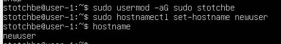
  

## Part 6. Установка и настройка службы времени

Вывод даты, времени и часового пояса, в котором сейчас находимся:

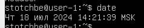

Вывод следующей команды (`timedatectl show`) содержит `NTPSynchronized=yes`:

    - NTP (Network Time Protocol) - протокол синхронизации часов компьютеров через сеть
    - NTPSynchronized - параметр, который отобржает состояние синхронизации времени системы с NTP
    - yes - система успешно синхронизировала свое время с сервером NTP

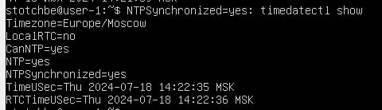

## Part 7. Установка и использование текстовых редакторов 

  1) Создание файла
   - при помощи nano `nano test_nano.txt`

     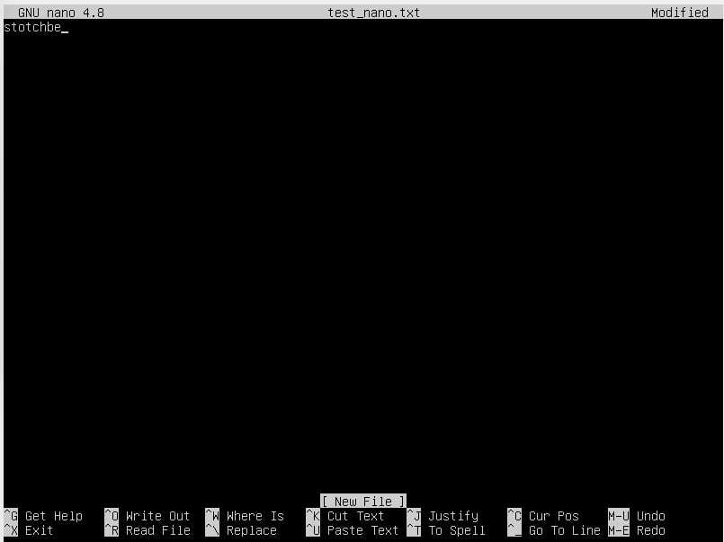 

     для выхода с сохранением нажимаем _ctrl + x_, _y_, _enter_

   - при помощи vim `vim test_vim.txt` (для ввода текста нажимаем i)

     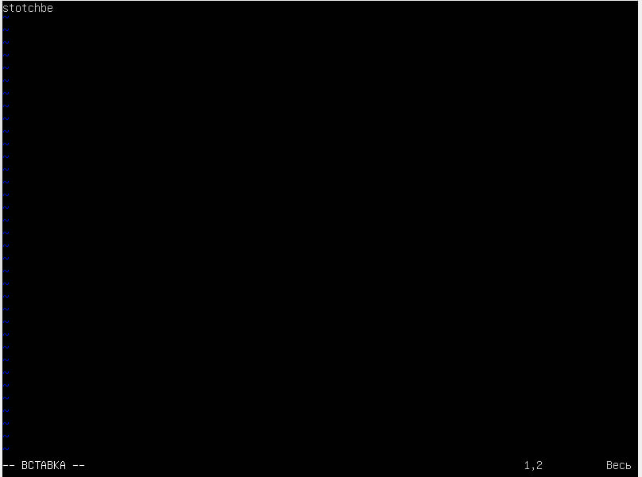 

     для выхода с сохранением нажимаем _esc_, _:wq_ и _enter_

   - устанавливаем редактор joe `sudo apt install joe`
   - создаем файл при помощи joe `joe test_joe.txt`

     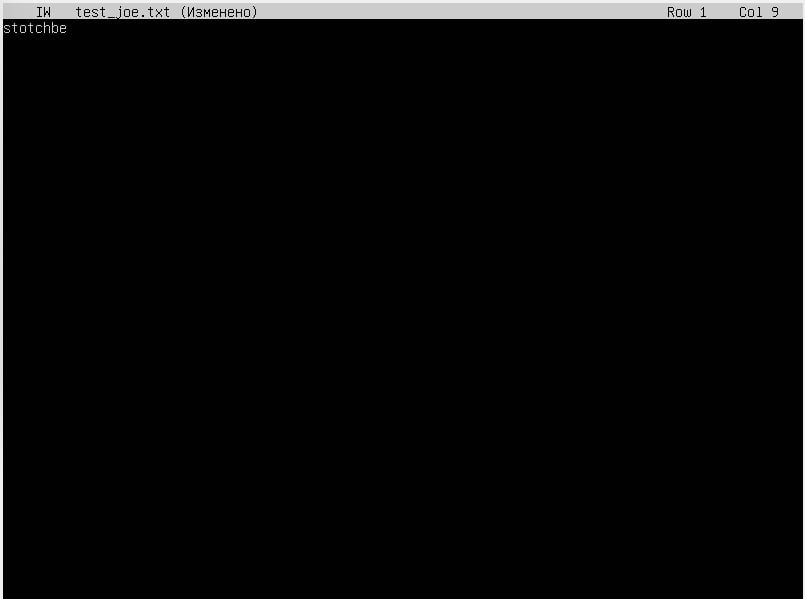 

     для выхода с сохранением нажимаем _ctrl + k_, _q_, _y_
 
 2) Выход без сохранения
   - открываем файл при помощи nano `nano test_nano.txt`

   отредактированный файл:

   

   для выхода без сохранения нажимаем _ctrl + x_, _n_

  - открываем файл при помощи vim `vim test_vim.txt`

   отредактированный файл:

   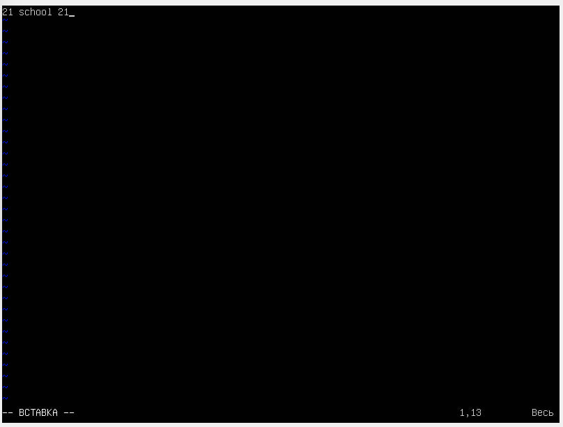

   для выхода без сохранения нажимаем _esc :q!_, _enter_

  - открываем файл при помощи joe `joe test_joe.txt`

   отредактированный файл:

   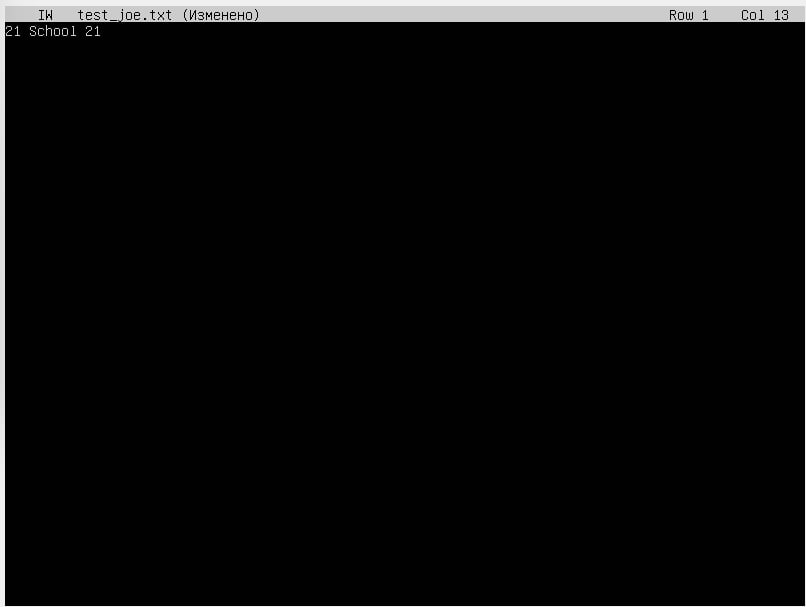

   для выхода без сохранения нажимаем _ctrl + k_, _q_, _n_ 
  
3) Поиск и замена слова. Во всех трех файлай никнейм предварительно заменен на "21 School 21".

  - открываем файл при помощи nano `nano test_nano.txt`\
   для поиска используем _ctrl + w_
   для замены используем _ctrl + \\_, _Ener_ и _y_\
   результат поиска слова "School":

   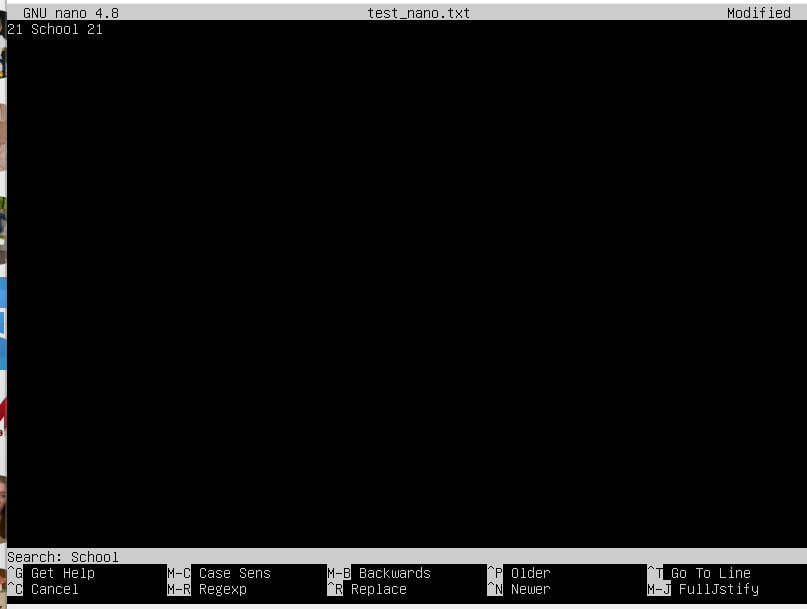

   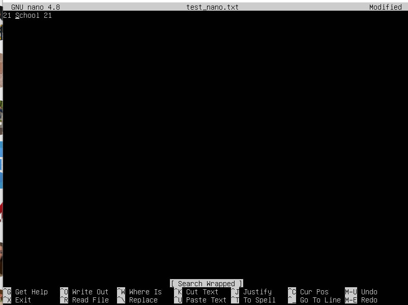

   результат замены слова:

   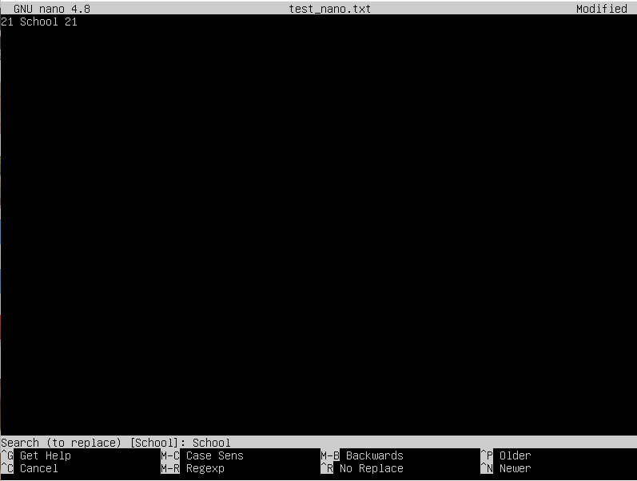

   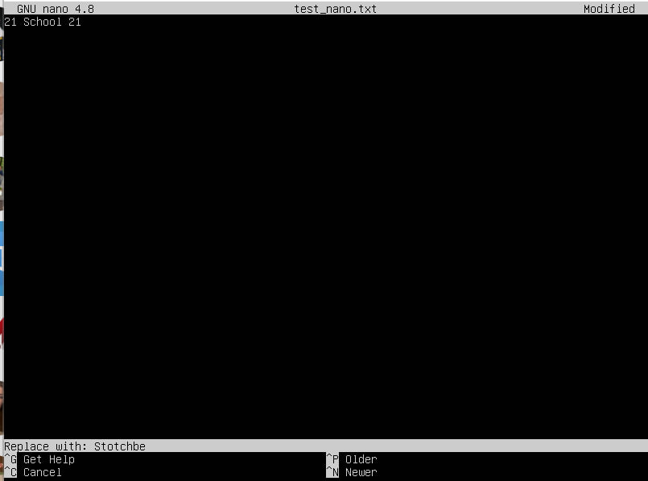

   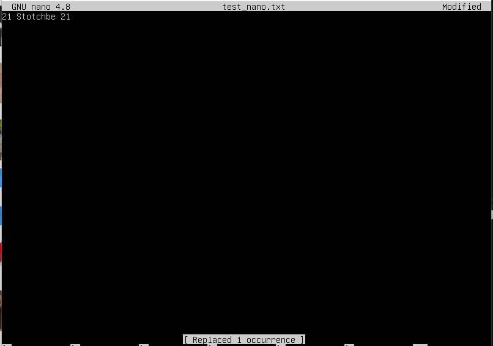

  - открываем файл при помощи vim `vim test_vim.txt`\
   для поиска используем _:s/_ \
   для замены используем _:s/_ предыдущий текст/новый текст\
   результат поиска слова "School":

   

   результат замены слова:

   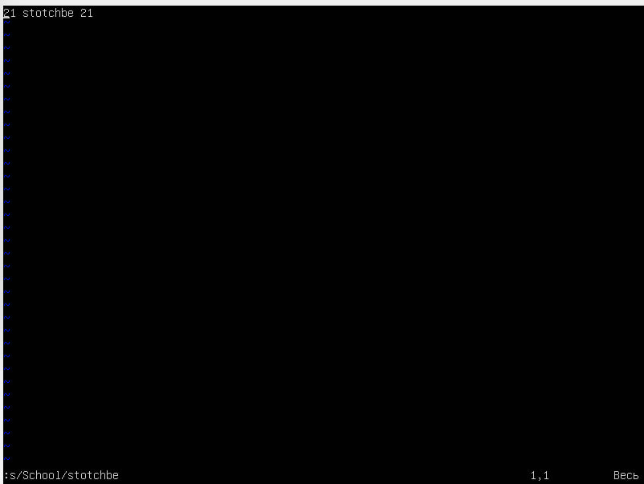

  - открываем файл при помощи joe `joe test_joe.txt`\
   для поиска используем _ctrl + k_, _f_

   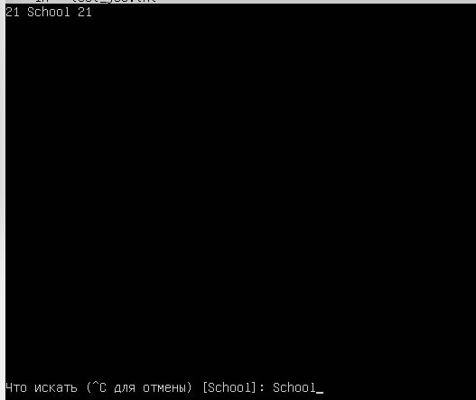

   результат поиска слова "School":

   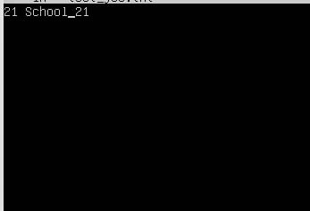

   для замены используем _ctrl + k_, _f_, _enter_, _r_, _enter_, _y_ 

   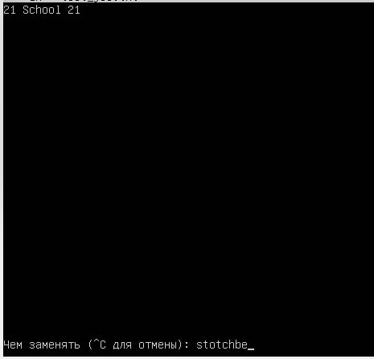

   результат замены слова:

   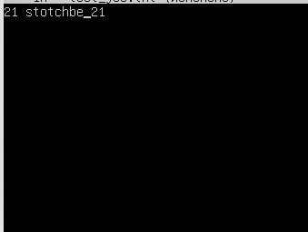

## Part 8. Установка и базовая настройка сервиса **SSHD**

1) Установка службы SSHd

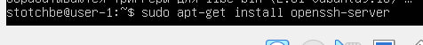

2) Автостарт при загрузке системы
 - служба SSHd работает

 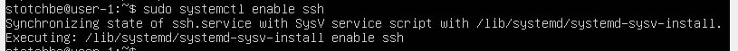

3) Для изменения порта на 2022 требуется отредактировать файл `sudo nano /etc/ssh/sshd_config`

 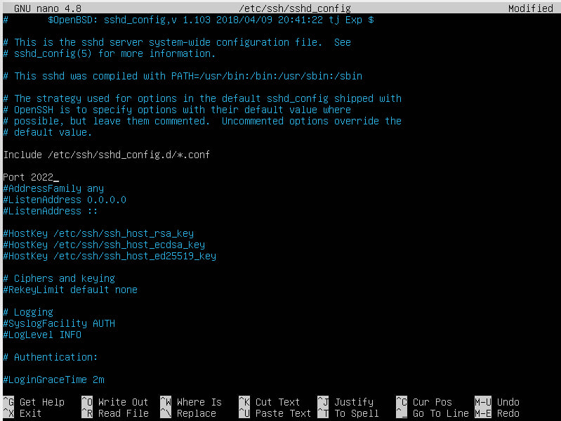

 для применения изменений:

 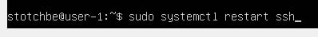

4) Вывод процесса ssh 

 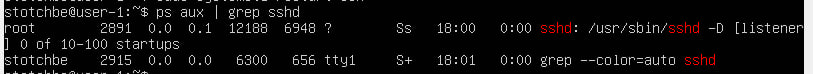

    - ps - отобразить информацию о запущенных процессах.
    - a - показать процессы всех пользователей.
    - u - Отобразить процессы в формате с более подробной информацией.
    - x - показать процессы без управляющего терминала.
    - | grep sshd - используется для фильтрации списка процессов и отображения только тех, которые содержат sshd.

 Перезагрузка системы с помощью `sudo reboot`

5) Вывод команды `netstat -tan` содержит `tcp 0 0 0.0.0.0:2022 0.0.0.0:* LISTEN`

 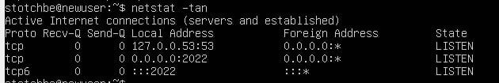

 - netstat(network status) отображает активные TCP-соединения, порты, которые прослушивает компьютер, статистику Ethernet, таблицу IP-маршрутизации.
    - t - отображение только TCP-портов
    - a - отображение всех открытых портов (как TCP, так и UDP)
    - n - отображение портов в числовом формате, без имен хостов и сервисов

- Значение столбцов вывода: 
    - Proto - название протокола 
    - Recv-Q - очередь получения сети 
    - Send-Q - сетевая очередь отправки 
    - Local Address - локальный IP-адрес, участвующий в соединении или связанный со службой, участвующей в соединении 
    - Foreign Address - внешний IP-адрес, учавствующий в создании соединения
    - State - состояние соединение
- Значение 0.0.0.0 - означает, что в соединении могут использоваться все IP-адреса на локальном компьютере.

## Part 9. Установка и использование утилит **top**, **htop**

- Вывод команды top с сортировкой по памяти Shift+M, по процессорному времени Shift+T

  - uptime: 25 min
  - количество авторизованных пользователей: 1
  - среднюю загрузку системы: 0.00
  - общее количество процессов: 111
  - загрузку cpu: 0.0% (Пользовательские процессы), 0.2% (Системные процессы), 0.0%(Приоритетные),  99.8%(Простой процессора),  0.0%(Ожидание завершения операций ввода/вывода), 0.0%(Аппаратные прерывания), 0.0%(Программные прерывания), 0.0%(Отбор гипервизором)
  - загрузку памяти: 4013792 KiB
  - pid процесса занимающего больше всего памяти:  599
  - pid процесса, занимающего больше всего процессорного времени: 1385

 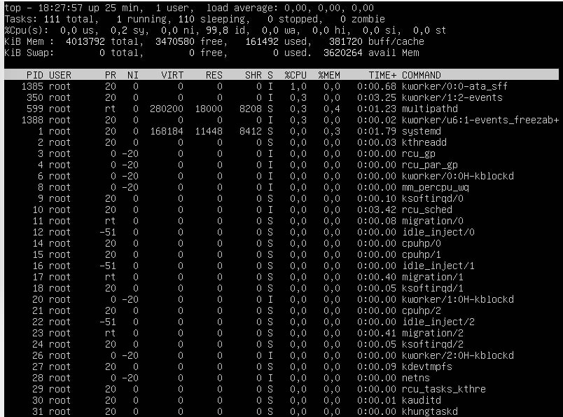

- Сортировка по PID: нажать F6, выбрать PID и нажать Enter.

  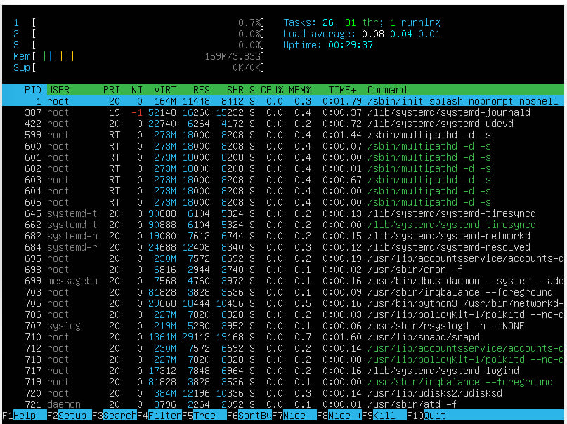

- Сортировка по PERCENT_CPU: нажать F6, выбрать PERCENT_CPU и нажать Enter.

  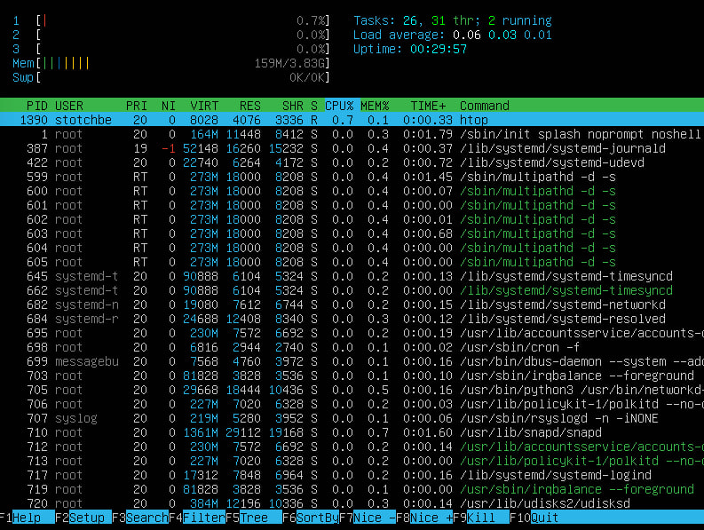

- Сортировка по PERCENT_MEM: нажать F6, выбрать PERCENT_MEM и нажать Enter.

  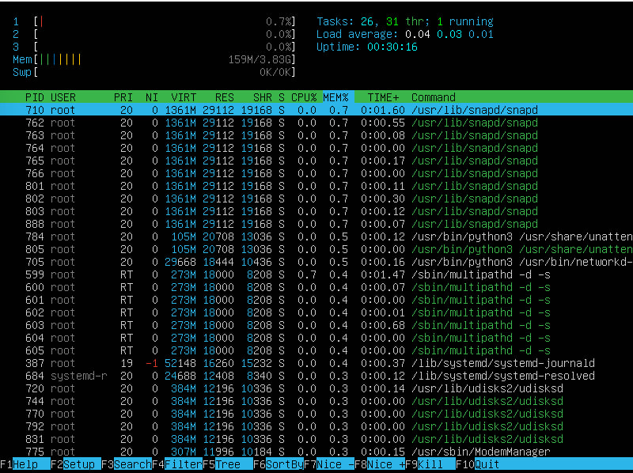

- Сортировка по TIME: нажать F6, выбрать TIME и нажать Enter.

  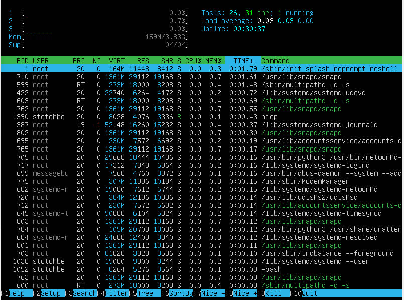

- Фильтрация по sshd: нажать F4, ввести sshd, нажать Enter.

  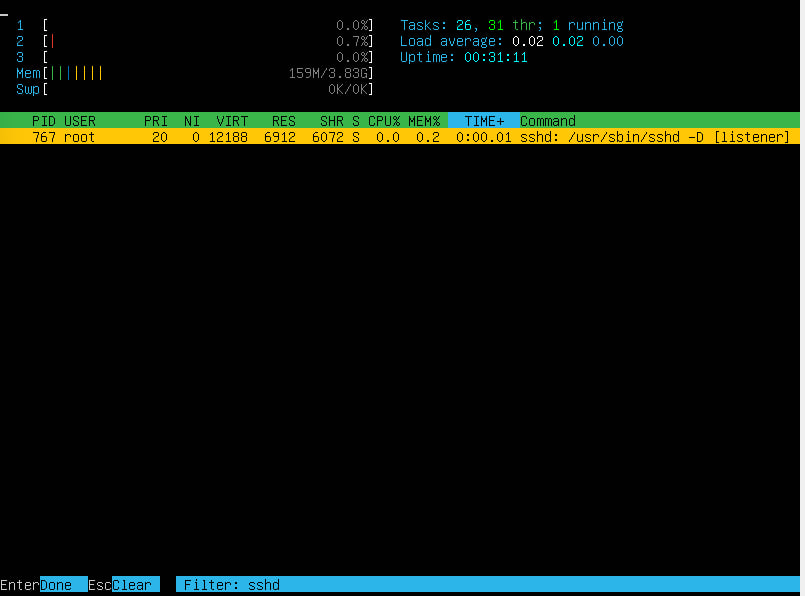

- Поиск процесса syslog: нажать F3, ввести syslog, нажать Enter.

  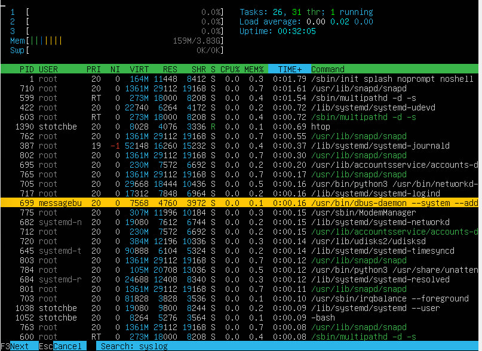

- Добавление hostname, clock и uptime: нажать F2, выбрать Setup, затем meters, включить Hostname, Clock, и Uptime

  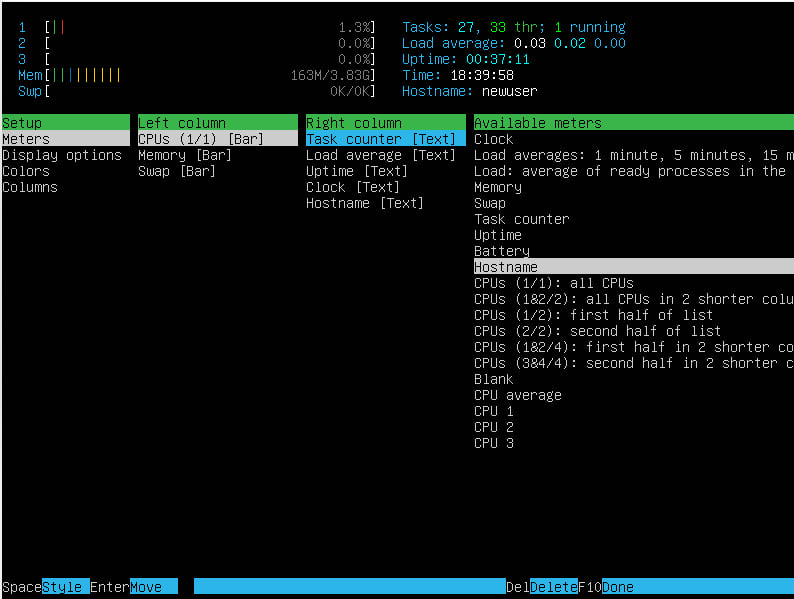

## Part 10. Использование утилиты **fdisk**

- `sudo fdisk -l`
    - -l (или --list) - этот ключ указывает fdisk вывести список всех разделов на всех дисках, которые он может обнаружить

 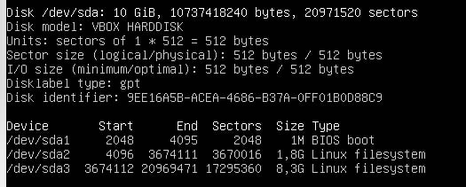

   - название жесткого диска: sda 
   - размер 10 GiB
   - количество секторов 20971520
   - размер swap  0 B
  
  Раздел swap может как создаваться в системе автоматически так и нет используя команду `free -h` можно увидеть размер swap.

   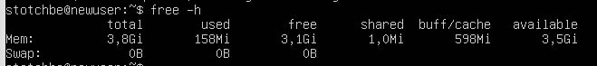

## Part 11. Использование утилиты **df** 

- Запущена команда df
    - df (disk free) - используется для отображения информации о файловых системах, их размере, занятом и свободном пространстве. Она показывает, сколько места доступно на каждом смонтированном файловом разделе, а также общую информацию о дисковых пространствах.

 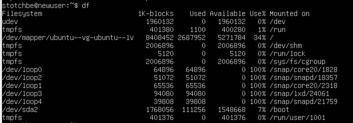

- Для корневого раздела (/):
  - размер раздела: 8408452
  - размер занятого пространства: 2687952
  - размер свободного пространства: 5271784
  - процент использования: 34%
  - Единица измерения: Килобайт

- Запущена команда df -Th
    - T - тип файловой системы
    - h - размеры в удобном для чтения формате

 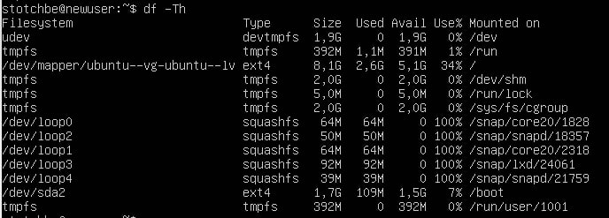

- Для корневого раздела (/):
  - размер раздела: 8.1 ГБ
  - размер занятого пространства: 2.6 ГБ
  - размер свободного пространства: 5.1 ГБ
  - процент использования: 34%
  - Тип файловой системы для раздела: ext4

## Part 12. Использование утилиты **du**

 - Запущена команда du
    - du - показывает, сколько места занимают файлы и каталоги на диске, а также анализирует размер отдельных файлов, директорий и их поддиректорий

    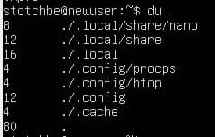

 - Размер папок /home, /var, /var/log
   - в байтах 
    - s - показывает только общий размер для указанного каталога, а не для каждого файла в нем

    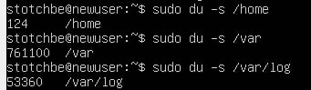

   - в человекочитаемом виде 
    - h - отображает размеры в человекочитаемом формате

    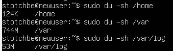
    
 - Размер всего содержимого в /var/log 

    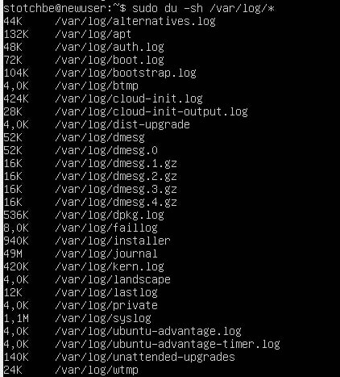
  

## Part 13. Установка и использование утилиты **ncdu**

 - Установка
    - ncdu (NCurses Disk Usage) — это текстовая утилита для анализа использования дискового пространства

  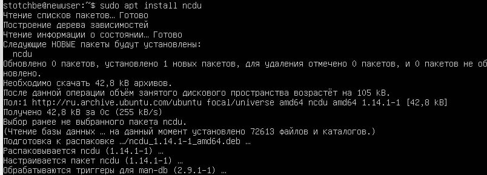

 - `ncdu /home`

  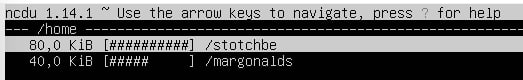

 - `ncdu /var`

  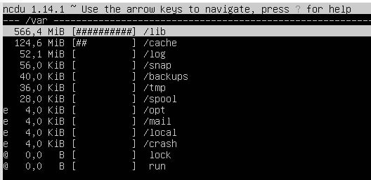

 - `ncdu /var/log`

  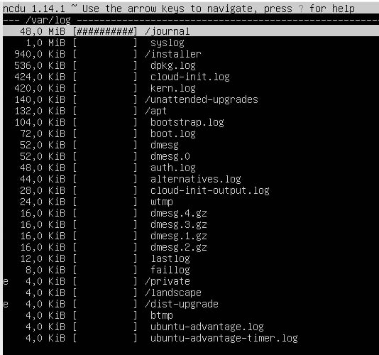

## Part 14. Работа с системными журналами

1) `sudo cat /var/log/dmesg`

   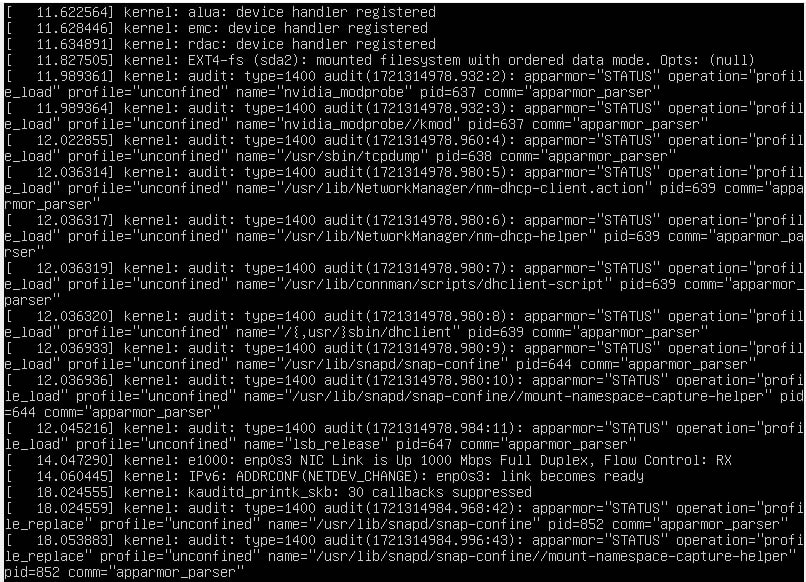

2) `sudo cat /var/log/syslog`

   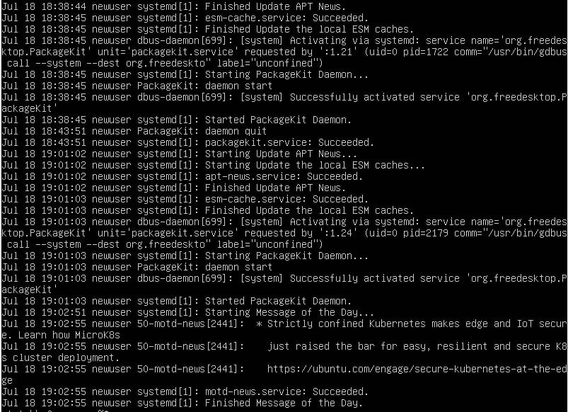

3) `sudo cat /var/log/auth.log`

   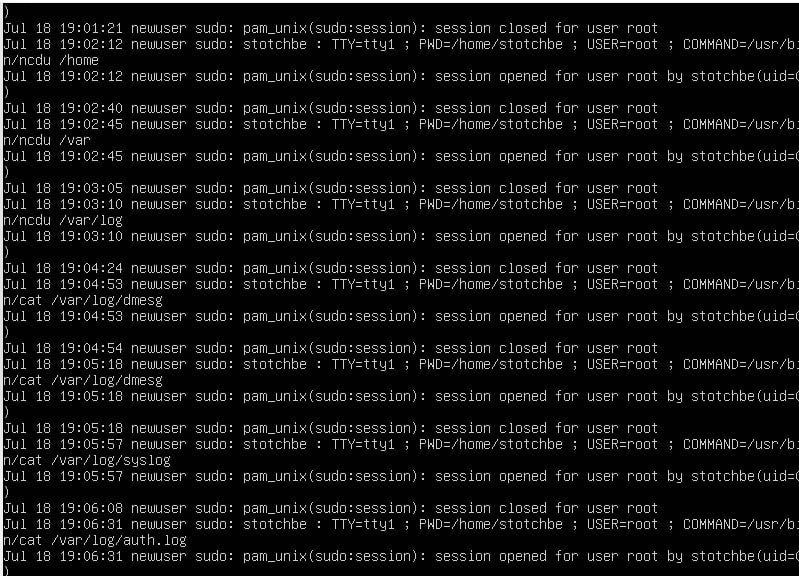

- Перезапустить службу SSHd
- Cкрин с сообщением о рестарте службы

  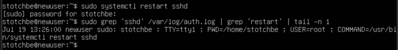

- Время последней успешной авторизации 18 Jul 19:07:35

 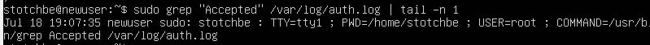

- Имя пользователя stotchbe
- Метод входа в систему tty1 (через консоль)

## Part 15. Использование планировщика заданий **CRON**

1) Используя планировщик заданий, запустить команду uptime через каждые 2 минуты

 `crontab -e`
    - эта команда открывает текущий файл планировщика задач для редактирования

 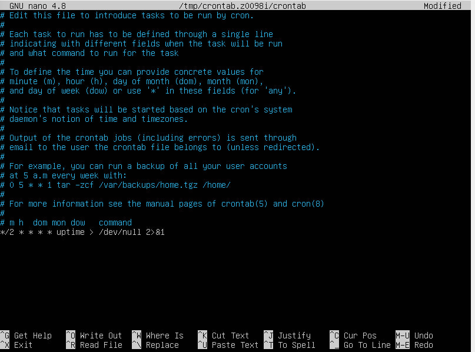

- Найти в системных журналах строчки (минимум две в заданном временном диапазоне) о выполнении

 `sudo cat /var/log/syslog`

 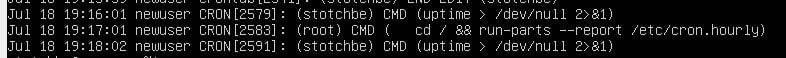

- Вывести на экран список текущих заданий для CRON

 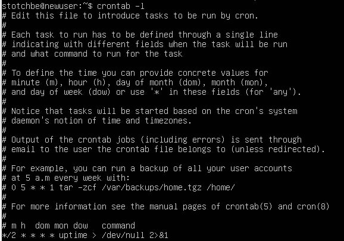

2) Удалить все задания из планировщика заданий

 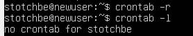