## Part 1. Инструмент **ipcalc**

#### 1.1. Сети и маски
- Устанавливаем ipcalc

	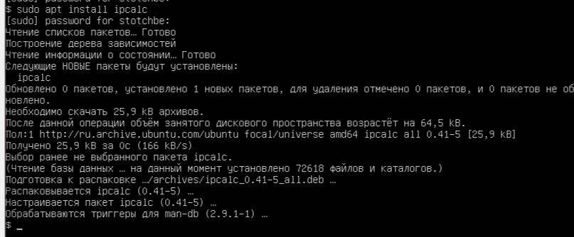

	ipcalc - это утилита, предназначенная дляработы с IP-адресами и сетевыми масками.

- Адрес сети _192.167.38.54/13_ 
	
	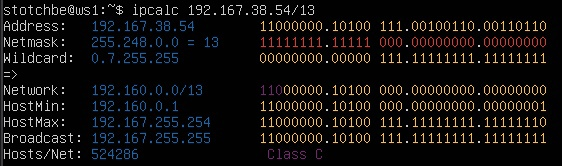

	определяется как `192.160.0.0`
	
- Перевод маски _255.255.255.0_
	
	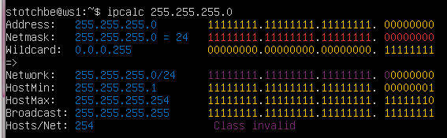
	
	в префиксную `/24`
	двоичную `11111111.11111111.11111111.00000000`

- Перевод маски _/15_
	
	
	
	в обычную `255.254.0.0`
	в двоичную `11111111.11111110.00000000. 00000000`
	
- Перевод `11111111.11111111.11111111.11110000` 
	
	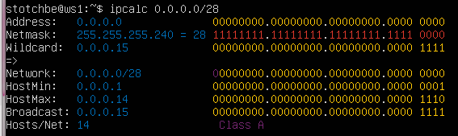
	
	в обычную `255.255.255.240`
	в префиксную `/28`

- Минимальный и максимальный хост в сети _12.167.38.4_:
	
- При маске `/8` 

	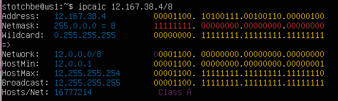
	
	HostMin `12.0.0.1`
	HostMax: `12.255.255.254`
	
- При маске `11111111.11111111.00000000.00000000` 
	
	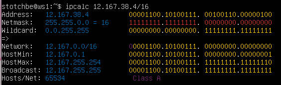
	
	HostMin:   `12.167.0.1`
	HostMax:   `12.167.255.254`
	
- При маске `255.255.254.0`
	
	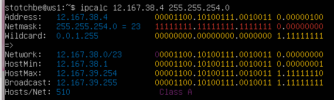
	
	HostMin:   `12.167.38.1`
	HostMax:   `12.167.39.254`
- При маске `/4`
	
	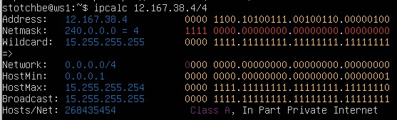
	
	HostMin:   `0.0.0.1`
	HostMax:   `15.255.255.254`

#### 1.2. localhost
- Можно ли обратиться к приложению, работающему на localhost, со следующими IP: `194.34.23.100`, `127.0.0.2`, `127.1.0.1`, `128.0.0.1`

	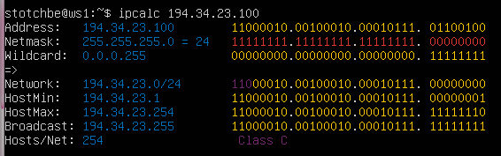
	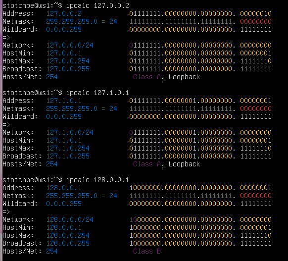

	Адреса в промежутке `127.0.0.0 — 127.255.255.255` зарезервированы системой под localhost. Также можно узнать это через ipcalc, в адресах, к которым можно обращаться, после _Class_ есть подпись _Loopback_.

	- 194.34.23.100 использовать нельзя
	- 127.0.0.2 использовать можно
	- 127.1.0.1 использовать можно
	- 128.0.0.1 использовать нельзя

#### 1.3. Диапазоны и сегменты сетей
1. Какие из перечисленных IP можно использовать в качестве публичного, а какие только в качестве частных: `10.0.0.45`, `134.43.0.2`, `192.168.4.2`, `172.20.250.4`, `172.0.2.1`, `192.172.0.1`, `172.68.0.2`, `172.16.255.255`, `10.10.10.10`, `192.169.168.1`

	Проверить является адрес частным можно с помощью ipcalc, у таких адресов после поля _Class_ имеется подпись _Private Internet_:

	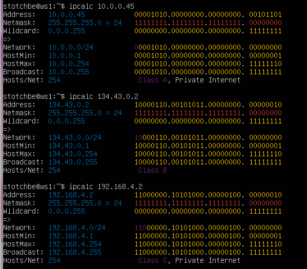
	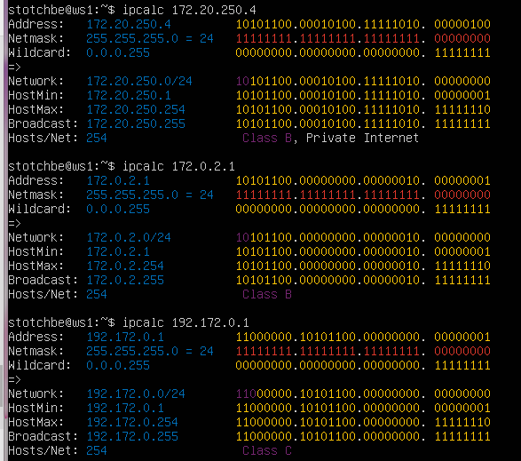
	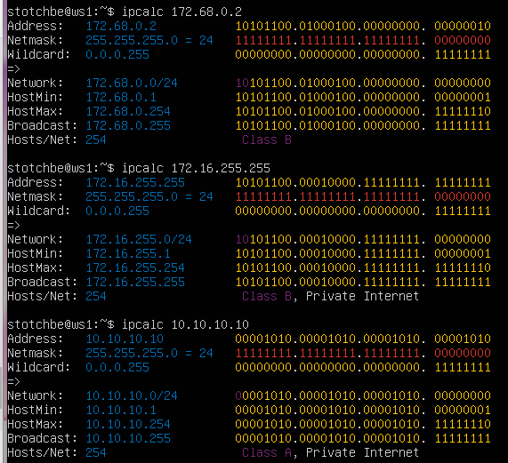
	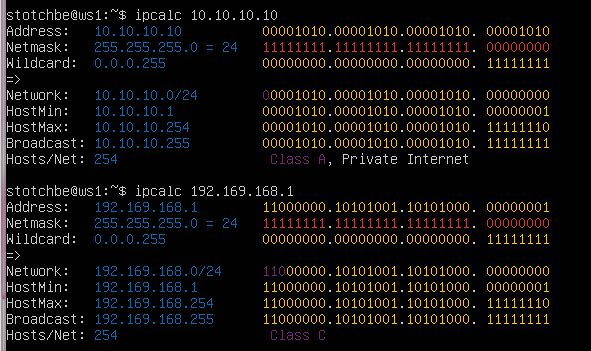

	Также частными адресами являются адреса, зарезервированные под localhost:
	- _127.0.0.0_ — _127.255.255.255_

		Соответственно:

	`10.0.0.45` - частный;
	`134.43.0.2` - публичный;
	`192.168.4.2` - частный;
	`172.20.250.4` - частный;
	`172.0.2.1` - публичный;
	`192.172.0.1` - публичный;
	`172.68.0.2` - публичный;
	`172.16.255.255` - частный;
	`10.10.10.10` - частный;
	`192.169.168.1` - публичный;

2. Какие из перечисленных IP адресов шлюза возможны у сети `10.10.0.0/18`: `10.0.0.1`, `10.10.0.2`, `10.10.10.10`, `10.10.100.1`, `10.10.1.255`

	Адрес шлюза — это IP-адрес устройства, которое служит точкой входа или выхода из одной сети в другую. 

	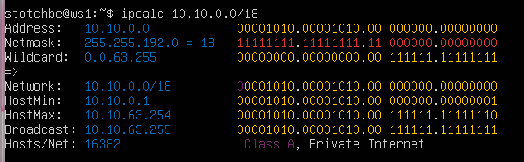
	
	Смотрим адреса, которые находятся между HostMin и HostMax:

	У данной сети адресом шлюза могут быть: `10.10.0.2`, `10.10.10.10`, `10.10.1.255`

## Part 2. Статическая маршрутизация между двумя машинами
- Две виртуальные машины:

	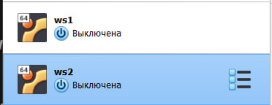

- Существующие сетевые интерфейсы

	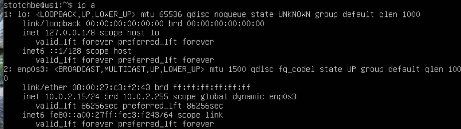
	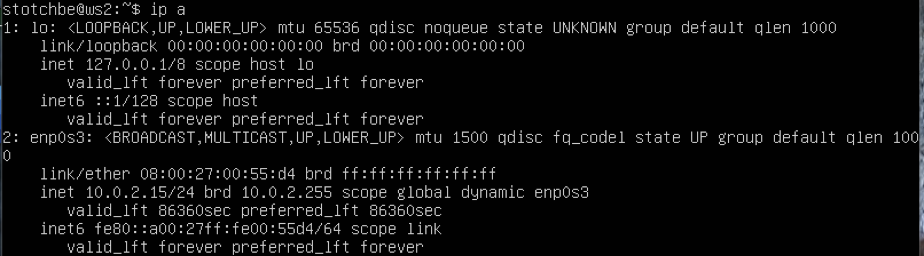

- Установление адресов и масок:

	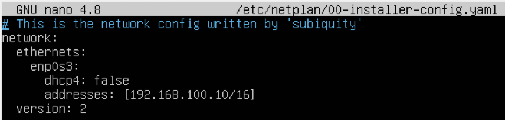
	
	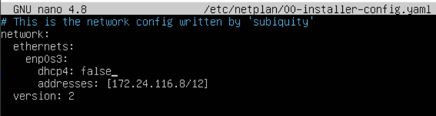

- Перезапуск сервиса сети:

	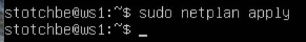

	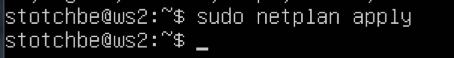

#### 2.1. Добавь статический маршрут вручную

- Добавление статического маршрута от одной машины до другой и обратно:

	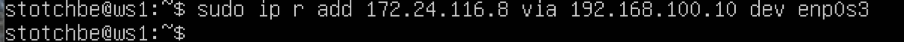
	
	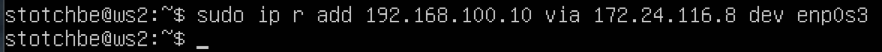
	
- Пинг соединения между машинами:

	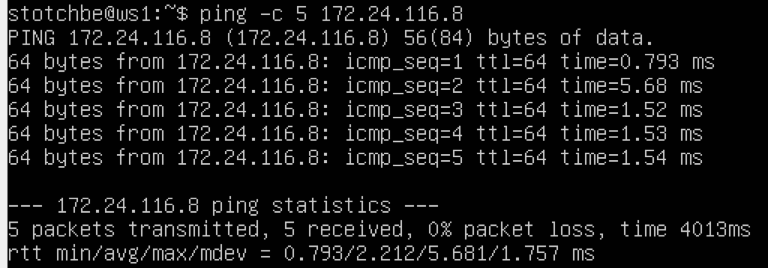
	
	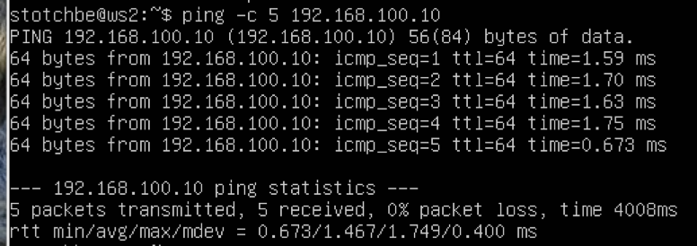

#### 2.2. Добавь статический маршрут с сохранением

- Добавление статического маршрута от одной машины до другой с помощью файла _etc/netplan/00-installer-config.yaml_:

	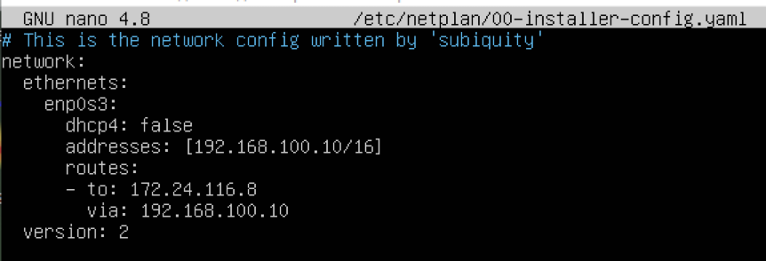
	
	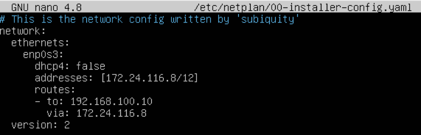
	
- Пинг соединения между машинами:

	Сначала применим изменения перезапустив сервис сети с помощью `sudo netplan apply`

	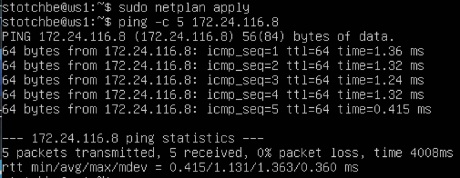
	
	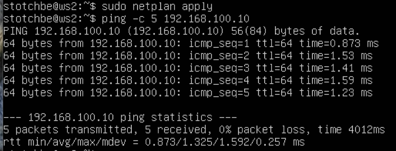

## Part 3. Утилита **iperf3**

#### 3.1. Скорость соединения

    8 Mbps равен 1 MB/s

	100 MB/s равен 800000 Kbps

	1 Gbps равен 1000 Mbps

#### 3.2. Утилита **iperf3**

- Измерение скорости соединения между ws1 и ws2:

	Запускаем сервер iperf3 на ws1

	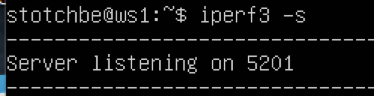

	С ws2 подключаемся к серверу(ws1) и измеряем скорость с помощью команды `ipcalc -c 192.168.100.10`:
	
	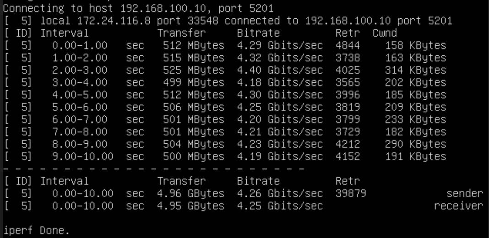

## 4.1. Утилита **iptables**

- Создание файла, имитирующего фаерволл, на ws1 и ws2:

	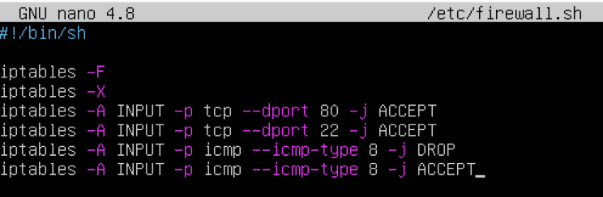
	
	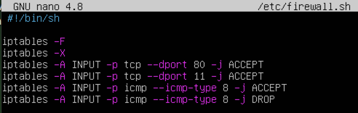

	Каждая команда iptables настраивает правила для управления сетевым трафиком.

	- -F - означает "flush" (сброс). Эта команда удаляет все текущие правила в таблице "filter" (по умолчанию, если не указана другая таблица). После выполнения этой команды никакие блокировки или разрешения трафика не будут действовать, пока не добавятся новые правила.

	- -X - означает "delete user-defined chains" (удалить пользовательские цепочки). Эта команда удаляет все пользовательские цепочки, которые были созданы вручную, но не являются встроенными цепочками (такими как INPUT, OUTPUT, FORWARD).

	- -A INPUT - добавляет (append) правило в цепочку INPUT, которая контролирует входящий трафик на машину.

	- -p tcp - правило касается трафика по протоколу TCP.

	- -p icmp - правило касается ICMP-пакетов (протокол, который используется для диагностики сети, например, для пинга).

	- --dport 80/22 - правило будет применяться только к пакетам, направленным на порт 80/22 (это стандартный порт для HTTP/SSH).

	- --icmp-type 8 - правило применяется только к ICMP-пакетам типа 8 (это тип пакета, который отправляется при запросе пинга — echo request).

	- -j ACCEPT - пакет должен быть принят (разрешен).

	- -j DROP - пакет должен быть отброшен (заблокирован).

-  Запуск файлов на обеих машинах:

	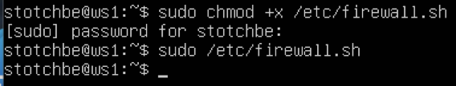
	
	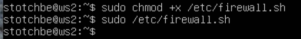

## 4.2. Утилита **nmap**
- Найдена машина, которая не «пингуется»

	запускаем ping на ws1 и видим, что ws2 отвечает на запрос

	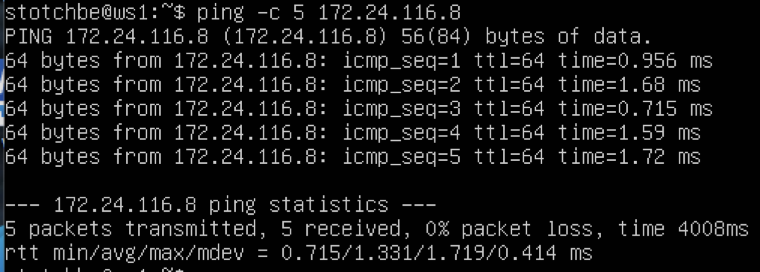

	при попытке запуска ping на ws2 получаем потерю пакетов, что и объявлено в фаерволе

	Это происходит из-за того, что фаерволы работают на основе набора правил, которые определяют, какой сетевой трафик разрешен или запрещен. Эти правила обычно обрабатываются последовательно — сверху вниз. Когда фаервол встречает первое правило, которое соответствует входящему или исходящему трафику, оно применяется, и дальнейшие правила не проверяются. В данных правилах фаервола первым идет правило запрета, и это правило блокирует трафик, прежде чем фаервол успевает дойти до разрешающего правила.

	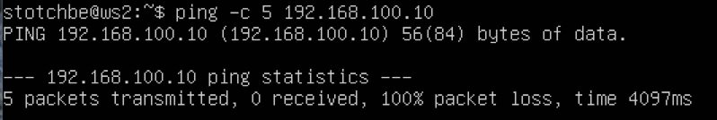

	проверяем запущена ли ws1 запустив с ws2 утилиту nmap

	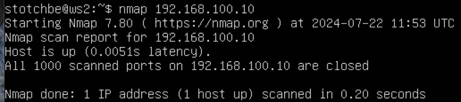

	по надписи _Host is up_ видим, что ws1 запущена

## Part 5. Статическая маршрутизация сети

 - 5 виртуальных машин, 2 из которых являются роутерами

	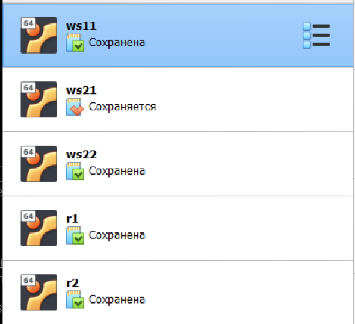

#### 5.1. Настройка адресов машин

- Настройка конфигурации машин в _etc/netplan/00-installer-config.yaml_ согласно сети на рисунке.

	r1 \
	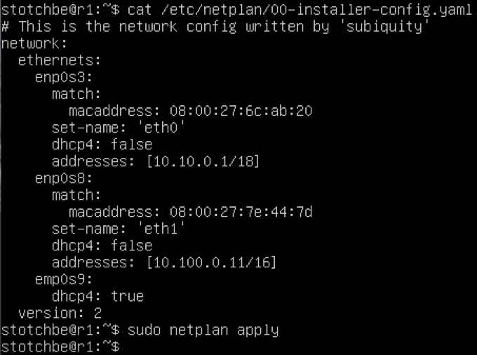

	r2 \
	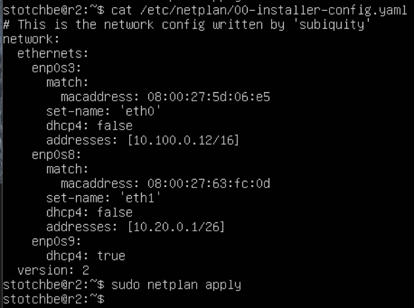

	ws11 \
	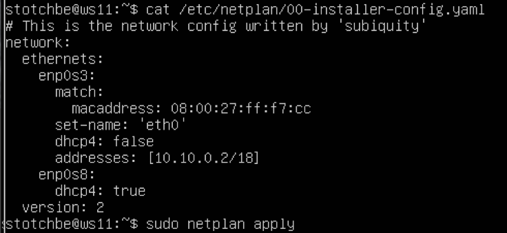

	ws21 \
	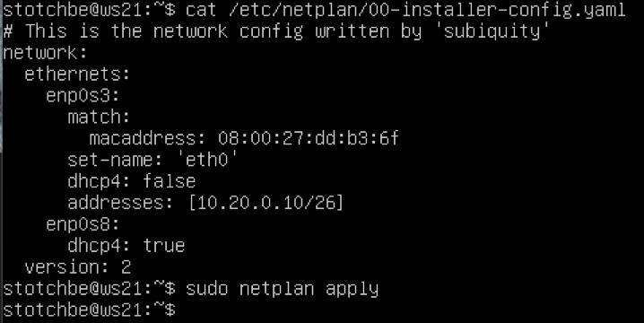

	ws22\
	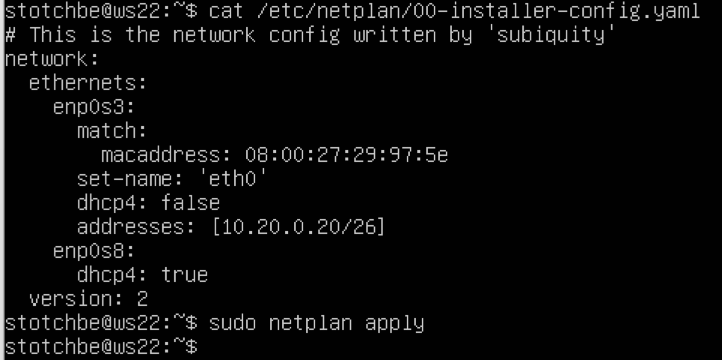

	`network` - корневая секция, описывающая конфигурацию сети
	`ethernets` - определение параметров для сетевых интерфейсов, настроенных на этом устройстве
	`enp0s3` \ `enp0s8` \ `enp0s9`- названия сетевых интерфейсов, настроенных в системе
		- match: — указывает на условия, которые должны совпасть, чтобы применить эту конфигурацию
		- `macaddress — соответствие по MAC-адресу (для идентификации)
		- set-name — переименование интерфейса
		- dhcp4: false — интерфейс не будет использовать DHCP для получения адреса, он будет настроен статически
		- dhcp4: true — для этого интерфейса будет использоваться DHCP для автоматического получения IP-адреса.
		- addresses — статический IP-адрес
	`version: 2` - версия схемы конфигурации Netplan.

	1-й сетевой адрес - 10.10.0.0
	2-й сетевой адрес - 10.100.0.0
	3-й сетевой адрес - 10.20.0.0

- Перезапуск сервисов сети. Проверка, что адрес машины задан верно:

	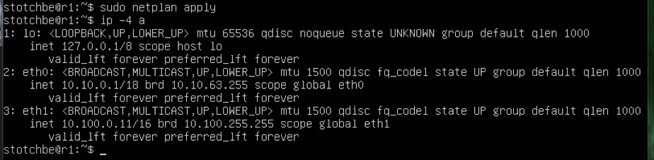

	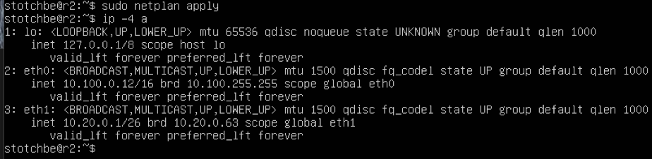

	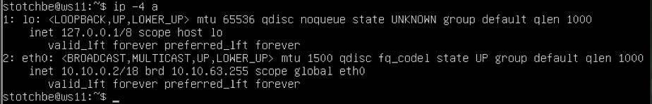

	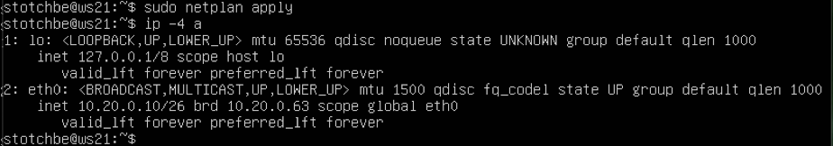

	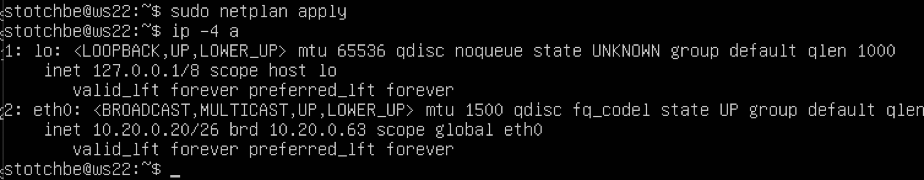

	Пропингуем ws22 c ws21.

	

	Теперь пропингуем r1 c ws11.

	

#### 5.2. Включение переадресации IP-адресов.

-  Включили переадресацию сети:

	

	

	Команда sudo sysctl -w net.ipv4.ip_forward=1 используется для включения пересылки IP-пакетов между интерфейсами на уровне ядра системы Linux. 

	- sudo - команда запускается с правами суперпользователя, поскольку изменение системных настроек требует привилегий администратора.

	- sysctl - позволяет просматривать и изменять параметры ядра Linux в режиме реального времени.

	- -w - (write) указывает sysctl, что надо изменить значение определенного параметра.

	- net.ipv4.ip_forward - это параметр ядра, отвечающий за пересылку IP-пакетов. Когда значение этого параметра установлено в 0, пересылка IP-пакетов отключена. Когда установлено в 1, пересылка включена.

	- net.ipv4 - указывает, что параметр относится к сетевой подсистеме для протокола IPv4.

	- ip_forward - конкретный параметр, который определяет, будет ли эта система пересылать пакеты между различными сетевыми интерфейсами (например, если система работает как маршрутизатор).

	- =1 - Устанавливает значение параметра net.ipv4.ip_forward в 1, что включает пересылку IP-пакетов.

- В файл _/etc/sysctl.conf_ добавили строку `net.ipv4.ip_forward = 1`:

	

	

#### 5.3. Установка маршрута по-умолчанию

- Настроили маршрут по-умолчанию (шлюз) для рабочих станций:

	

	

	

	- to - указывает на маршрутизируемую сеть. Трафик, направленный в данную сеть, должен быть маршрутизирован по указанному ниже пути
	- via - шлюз (маршрутизатор). Используется как точка перехода трафика в сеть выше

- Маршрут добавился в таблицу маршрутизации:

	

	

	

	строка [сеть назначения] dev eth0 proto kernel scope link src [исходный адрес] является записью маршрута в таблице маршрутизации.

	- dev означает "устройство", а eth0 — это сетевой интерфейс, через который пакеты для данной подсети будут отправляться.
	
	- proto kernel означает, что этот маршрут был добавлен автоматически ядром операционной системы (например, при поднятии сетевого интерфейса) и не был явно установлен пользователем.

	- scope описывает область видимости маршрута, т.е. определяет, к каким интерфейсам относится данный маршрут.

- Пинг с ws11 роутером r2:

	

	

#### 5.4. Добавление статических маршрутов

- Добавлены в роутеры r1 и r2 статические маршруты в файле конфигураций:

	

	

- Запуск команды на ws11:

	

	маршрутизатор выбирает маршрут, отличный от маршрута по умолчанию, так как такое решение является более точным. Таким образом, если существует маршрут, отличный от нулевой маски, то маршрут по умолчанию никогда не будет выбран.

#### 5.5. Построение списка маршрутизаторов

- Построен список маршрутизаторов на пути от ws11 до ws21

	- Вызов команды на машине ws11
	
	

	traceroute использует серию ICMP-пакетов, увеличивая значение поля TTL с каждым шагом, чтобы определить промежуточные маршрутизаторы. Первая серия пакетов отправляется с TTL=1, что заставляет первый маршрутизатор вернуть сообщение "time exceeded in transit". Затем процесс повторяется с увеличением TTL, пока пакет не достигнет целевого узла. Каждый маршрутизатор фиксируется, и время между отправкой пакета и получением ответа выводится на монитор.

	- Вызов команды `tcpdump -tnv -i eth0` на роутере r1

	

	- tcpdump — это утилита для захвата и анализа сетевых пакетов, передаваемых через сетевые интерфейсы. Она позволяет вам видеть детализированную информацию о сетевом трафике, проходящем через заданный интерфейс.

		- -t: убирает метку времени из вывода. Без этой опции каждая строка захваченного пакета начинается с временной метки. Опция -t отключает эту временную информацию, оставляя только данные о пакетах

		- -n: отключает преобразование IP-адресов и портов в имена.

		- -v: включает повышенную детализацию в выводе. Эта опция добавляет дополнительную информацию о каждом захваченном пакете, такую как время жизни пакета (TTL), идентификатор пакета, длину заголовков и так далее. При повторном использовании (например, -vv или -vvv) уровень детализации может быть еще больше увеличен.

		- -i eth0: указывает, что захват пакетов должен производиться на интерфейсе eth0. В вашем случае это первый сетевой интерфейс, обычно используемый для подключения к сети. Если интерфейс не указан, tcpdump захватывает трафик с первого доступного интерфейса по умолчанию.

#### 5.6. Использование протокола **ICMP** при маршрутизации

- Перехват сетевого трафика, проходящего через eth0:

	

	- icmp: указывает фильтр для захвата только ICMP-пакетов. 

- Пинг несуществующего IP:

	

## Part 6. Динамическая настройка IP с помощью **DHCP**

- Настройка конфигурации службы **DHCP** для r2 в файле _/etc/dhcp/dhcpd.conf_:

	

	- subnet 10.20.0.0 netmask 255.255.255.192 - конфигурирует подсеть 10.20.0.0/26 с маской подсети 255.255.255.192

	- range - задает диапазон IP-адресов, которые DHCP сервер будет раздавать в сети 10.20.0.0/26. Диапазон от 10.20.0.2 до 10.20.0.50 определяет, что DHCP сервер будет выдавать IP-адреса только в этом диапазоне

	- option routers - указывает шлюз по умолчанию (default gateway) для устройств, которые получат IP-адреса от DHCP. Шлюз в данном случае — это 10.20.0.1

	- option domain-name-servers - указывает IP-адрес DNS сервера. В данном случае устройства будут использовать 10.20.0.1 в качестве DNS сервера

- Изменение файла _resolv.conf_:

	

	- nameserver - указывает на использование публичного DNS-сервера от Google для разрешения доменных имен

	- options edns0 trust-ad:

		- edns0 - включает поддержку расширений DNS (EDNS0), что позволяет использовать более длинные сообщения DNS и дополнительные функции.

		- trust-ad - говорит системе доверять сообщениям с пометкой "доверенный ответ" (AD bit) от DNS серверов.

- Перезагрузка службы **DHCP**

	

- Перезагрузка ws21 с помощью `reboot`:

	

- Пинг ws22 с ws21:

	

- Указание MAC адрес у ws11:

	

- Настройка r1 аналогично r2 с выдачей адресов с  жесткой привязкой к MAC-адресу (ws11)

	

	- host ws11 { hardware ethernet 10:10:10:10:10:BA; } - определяет статическую конфигурацию для устройства с MAC-адресом

	

	

- Запрос с ws21 обновления ip адреса

	До:

	

	После:

	

	- subnet - определяет подсети, для которых DHCP сервер будет раздавать IP-адреса
	- range - задает диапазон IP-адресов, которые DHCP сервер может выдавать 
	- option routers - указывает IP-адрес шлюза по умолчанию
	- option domain-name-servers - указывает IP-адрес DNS-сервера
	- host - определяет статическое назначение IP-адреса для устройства с определённым MAC-адресом

## Part 7. **NAT**

- Изменение строки в файле для общедоступности сервера Apache2

	

	

- Запуск веб-сервера Apache на ws22 и r1

	

	

- Добавление в фаервол, созданный по аналогии с фаерволом из Части 4, на r2 новых правил:

	

	Каждая команда iptables настраивает правила для управления сетевым трафиком.

	- -F - означает "flush" (сброс). Эта команда удаляет все текущие правила в таблице "filter" (по умолчанию, если не указана другая таблица). После выполнения этой команды никакие блокировки или разрешения трафика не будут действовать, пока не добавятся новые правила.

	- Таблица nat управляет трансляцией сетевых адресов. Она используется для NAT (в том числе SNAT и DNAT), что позволяет изменять IP-адреса исходящих или входящих пакетов.

	- --policy FORWARD DROP - изменяет политику по умолчанию для цепочки FORWARD на DROP. Цепочка FORWARD отвечает за пакеты, которые не предназначены для локальной системы, а должны быть пересланы через нее на другой узел. Установка политики DROP по умолчанию означает, что все пересылаемые пакеты будут блокироваться, если не будут явно разрешены другими правилами.

	Запуск файла с помощью команд `sudo chmod +x /etc/firewall.sh` и `sudo /etc/firewall.sh`

	Пингуем соединение между ws22 и r1

	

4) Разрешение маршрутизации всех пакетов протокола **ICMP**

	Пингуем соединение между ws22 и r1

	

	

5) Включение **SNAT** и Включить **DNAT** 

	

	Каждая команда iptables настраивает правила для управления сетевым трафиком

	- -F - означает "flush" (сброс). Эта команда удаляет все текущие правила в таблице "filter" (по умолчанию, если не указана другая таблица). После выполнения этой команды никакие блокировки или разрешения трафика не будут действовать, пока не добавятся новые правила

	- -t nat - очистка будет происходить в таблице nat, которая отвечает за трансляцию сетевых адресов (NAT). Это удаляет все существующие правила для NAT (например, переадресацию портов)

	- --policy - FORWARD DROP устанавливает политику по умолчанию для цепочки FORWARD на DROP. Это значит, что весь пересылаемый через хост трафик будет по умолчанию блокироваться, если явно не будут добавлены разрешающие правила

	- -A - append; добавляет новое правило в конец цепочки FORWARD

	- -p icmp - правило касается ICMP-пакетов (протокол, который используется для диагностики сети, например, для пинга)

	- -p tcp - правило касается трафика по протоколу TCP
	
	- --dport 80 - правило будет применяться только к пакетам, направленным на порт 80 (это стандартный порт для HTTP)

	- -j ACCEPT - пакет должен быть принят (разрешен)

	- -A POSTROUTING - добавляет правило в цепочку POSTROUTING, которая применяется к пакетам после маршрутизации (перед отправкой их на внешний интерфейс)

	- -o enp0s8 -  правило применяется к пакетам, которые отправляются через интерфейс enp0s8 (выходящий интерфейс)

	- -s - применяется к пакетам, исходящим из указанной подсети

	- -j SNAT - применяет Source Network Address Translation (SNAT) к пакетам, изменяя их исходный IP-адрес

	- --to-source - исходный IP-адрес пакетов будет изменен на указанный адрес

	- -A PREROUTING - добавляет правило в цепочку PREROUTING, которая применяется к пакетам до их маршрутизации (на этапе их получения)

	- --dport 8080 - применяется к TCP-пакетам, направленным на порт 8080

	- -j DNAT - применяет Destination Network Address Translation (DNAT), изменяя IP-адрес назначения пакетов

	--to-destination - пакеты, направленные на порт 8080, будут перенаправлены на указанный адрес и указанный порт

7) Проверка соединение по TCP для **SNAT**

	

8) Проверка соединение по TCP для **DNAT**

	

## Part 8. Дополнительно. Знакомство с **SSH Tunnels**

- Запуск на r2 фаервол с правилами из Части 7.

	

	Запускаем с помощью команд `sudo chmod +x /etc/firewall.sh` и `sudo /etc/firewall.sh`

- Запуск веб-сервера Apache на ws22 только на localhost

	

	

- Получение доступа к веб-серверу на ws22 с ws21

	Используем команду `ssh -L 1234:localhost:80 10.20.0.20`

	

	Проверка, что подключение успешно

	

- Получение доступа к веб-серверу на ws22 с ws11

	открытие порта в файерволе (порт 22 открыт на вход и выход)

	

	открываем удаленное соединение на целевом хосте (ws22) с помощью команды `ssh -R 1234:localhost:80 10.10.0.2`

	

	проверяем, что удаленное соединение работает и команда telnet отрабатывает от айпи адреса ws22

	