<h1 style="color: pink">Отчет по Docker
<h1 style="color: pink">Part 1. Готовый докер.</h1>

### Возьми официальный докер образ с nginx и выкачай его при помощи `docker pull`
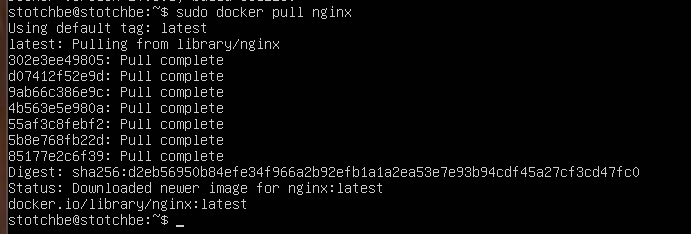

### Проверь наличие докер образа через `docker images`
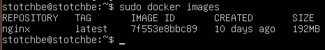

### Запусти докер образ через `docker run -d [image_id|repository]`
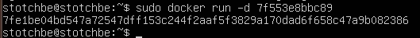

### Проверь, что образ запустился через `docker ps`
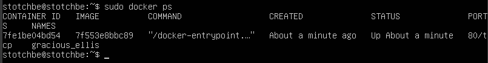

### Посмотри информацию о контейнере через `docker inspect [container_id|container_name]`
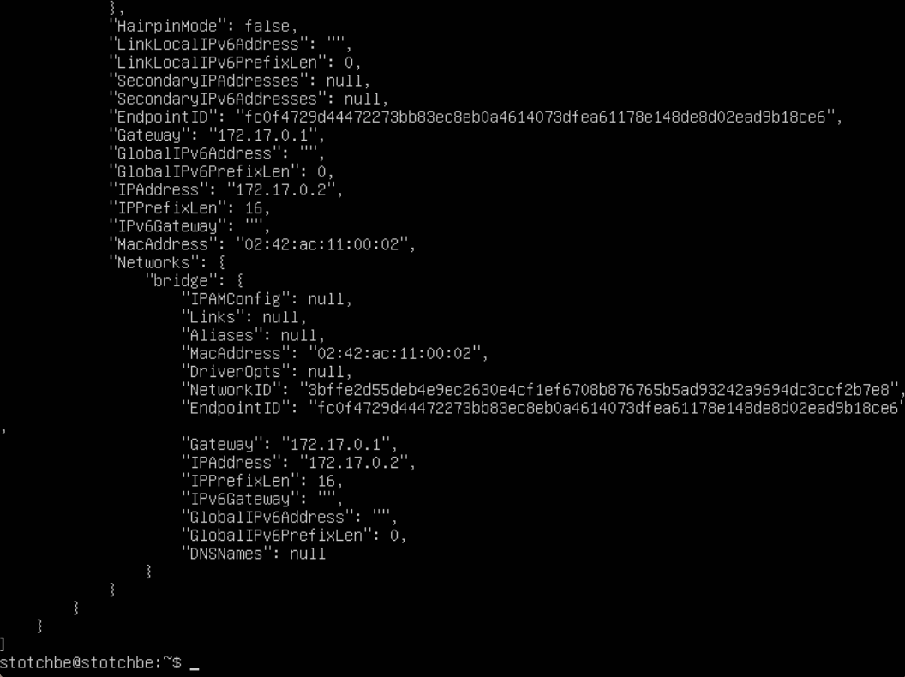

### По выводу команды определи и помести в отчёт размер контейнера, список замапленных портов и ip контейнера
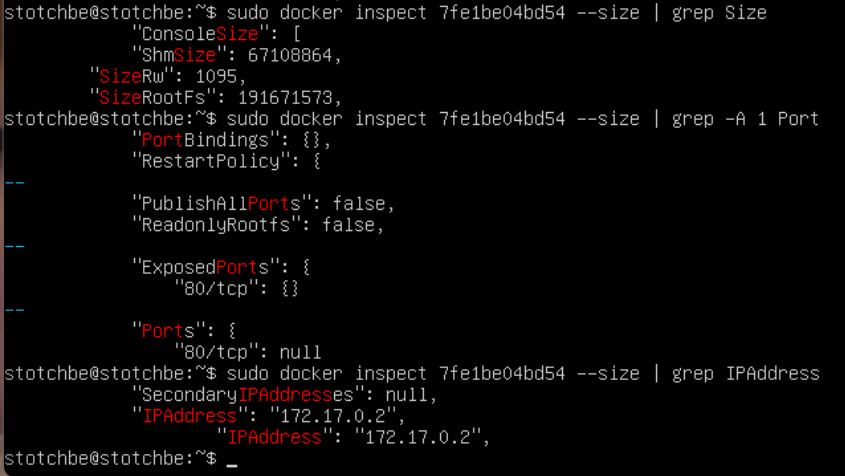

Размер контейнера - 67108864
Список замапленных портов - 80/tcp
ip контейнера - 172.17.0.2

### Останови докер образ через `docker stop [container_id|container_name]`

### Проверь, что образ остановился через `docker ps`
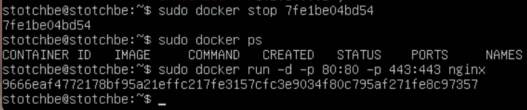

### Запусти докер с портами 80 и 443 в контейнере, замапленными на такие же порты на локальной машине, через команду run

### Проверь, что в браузере по адресу localhost:80 доступна стартовая страница nginx

sudo docker run -d -p 80:80 -p 443:443 nginx

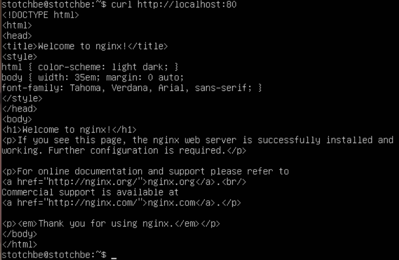

### Перезапусти докер контейнер через `docker restart [container_id|container_name]`

### Проверь любым способом, что контейнер запустился
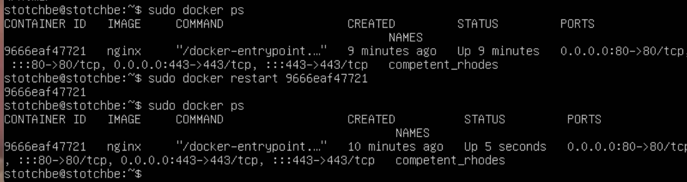

<h1 style="color: pink">Part 2. Операции с контейнером.</h1>

### Прочитай конфигурационный файл nginx.conf внутри докер контейнера через команду `exec`
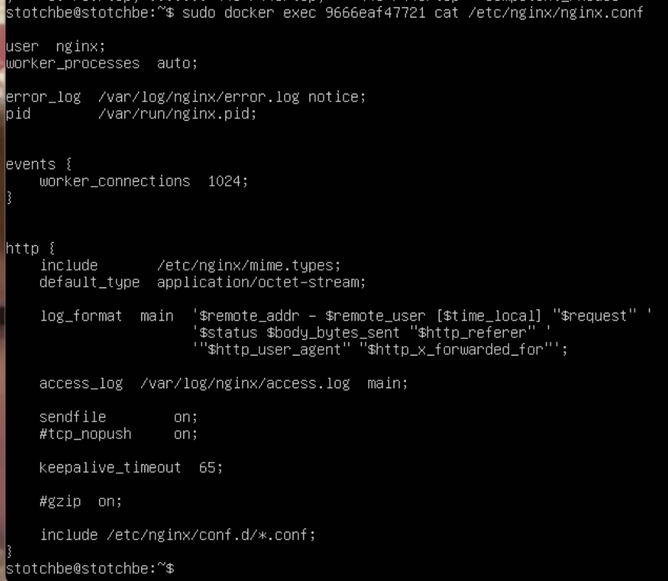

### Создай на локальной машине файл nginx.conf
### Настрой в нем по пути /status отдачу страницы статуса сервера nginx
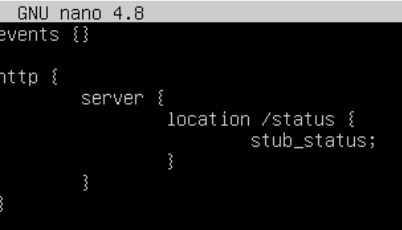

### Скопируй созданный файл nginx.conf внутрь докер образа через команду `docker cp`
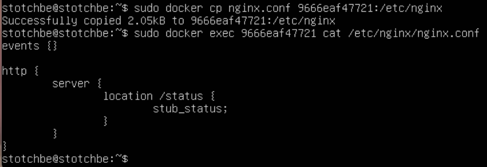

### Перезапусти nginx внутри докер образа через команду `exec`
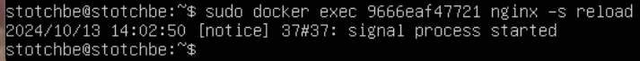

### Проверь, что по адресу localhost:80/status отдается страничка со статусом сервера nginx
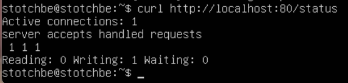

### Экспортируй контейнер в файл container.tar через команду `export`
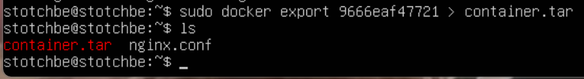

### Останови контейнер
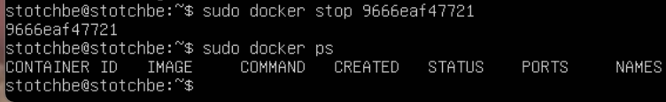

### Удали образ через `docker rmi [image_id|repository]`, не удаляя перед этим контейнеры
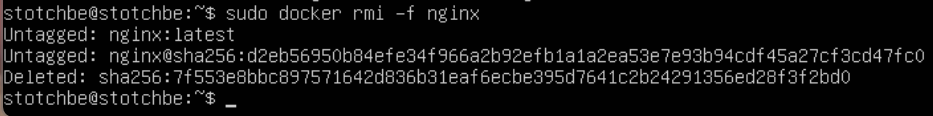

### Удали остановленный контейнер
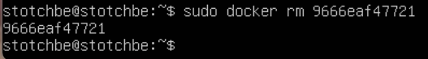

### Импортируй контейнер обратно через команду `import`
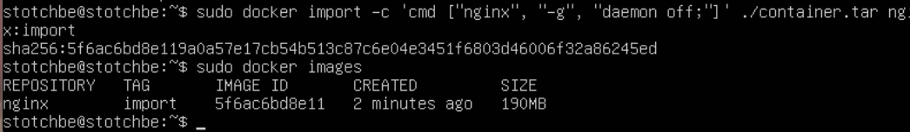

### Запусти импортированный контейнер
### Проверь, что по адресу localhost:80/status отдается страничка со статусом сервера nginx
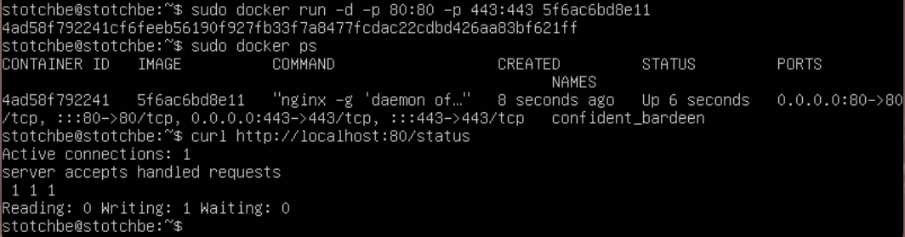

<h1 style="color: pink">Part 3. Мини веб-сервер.</h1>

### Напиши мини-сервер на C и FastCgi, который будет возвращать простейшую страничку с надписью Hello World!
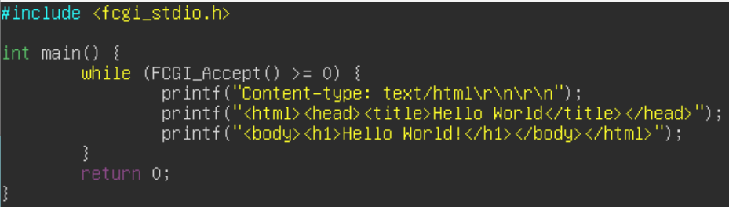

### Запусти написанный мини-сервер через spawn-fcgi на порту 8080
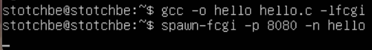

### Напиши свой nginx.conf, который будет проксировать все запросы с 81 порта на 127.0.0.1:8080
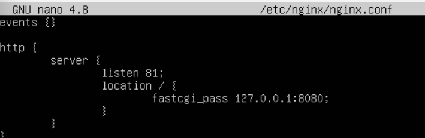

### Проверь, что в браузере по localhost:81 отдается написанная тобой страничка
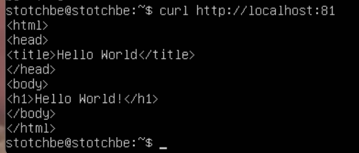

### Положи файл nginx.conf по пути ./nginx/nginx.conf (это понадобится позже)

<h1 style="color: pink">Part 4. Свой докер.</h1>

### Напиши свой докер образ, который:
<ul style="color: cyan">
  <li>собирает исходники мини сервера на FastCgi из Части 3</li>
  <li>запускает его на 8080 порту</li>
  <li>копирует внутрь образа написанный ./nginx/nginx.conf</li>
  <li>запускает nginx.</li>
</ul>

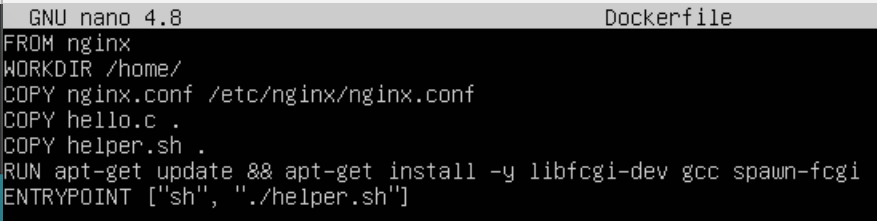
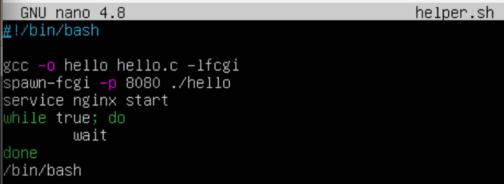

### Собери написанный докер образ через docker build при этом указав имя и тег
sudo docker build -t stotchbe:stot .
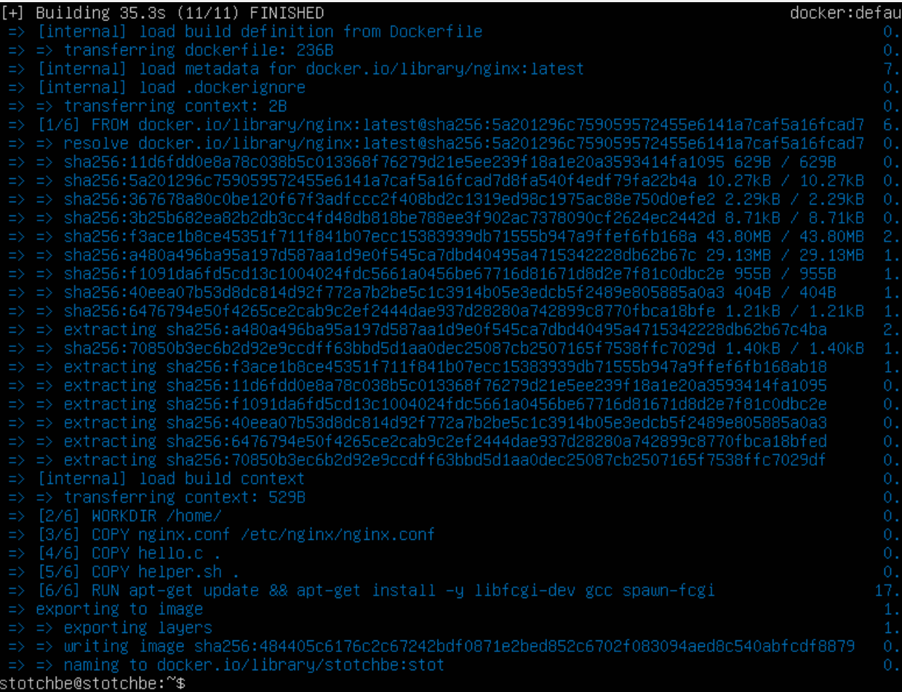

### Проверь через docker images, что все собралось корректно
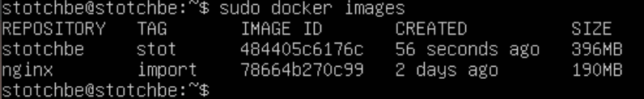

### Запусти собранный докер образ с маппингом 81 порта на 80 на локальной машине и маппингом папки ./nginx внутрь контейнера по адресу, где лежат конфигурационные файлы nginx'а.
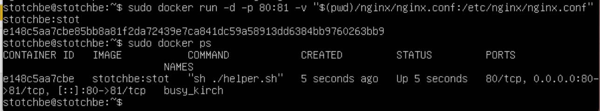

### Проверь, что по localhost:80 доступна страничка написанного мини сервера
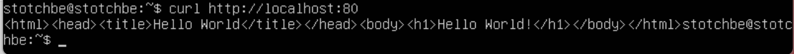

### Допиши в ./nginx/nginx.conf проксирование странички /status, по которой надо отдавать статус сервера nginx
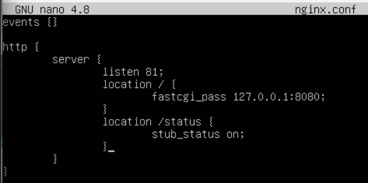

### Перезапусти докер образ
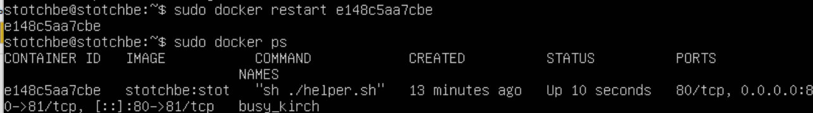

### Проверь, что теперь по localhost:80/status отдается страничка со статусом nginx
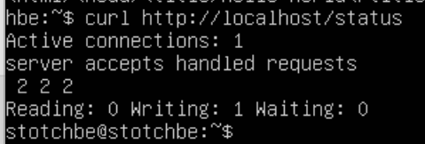

<h1 style="color: pink">Part 5. Dockle.</h1>

### Просканируй образ из предыдущего задания через `dockle [image_id|repository]`
docker run --rm -v /var/run/docker.sock:/var/run/docker.sock goodwithtech/dockle:latest stotchbe:stot5
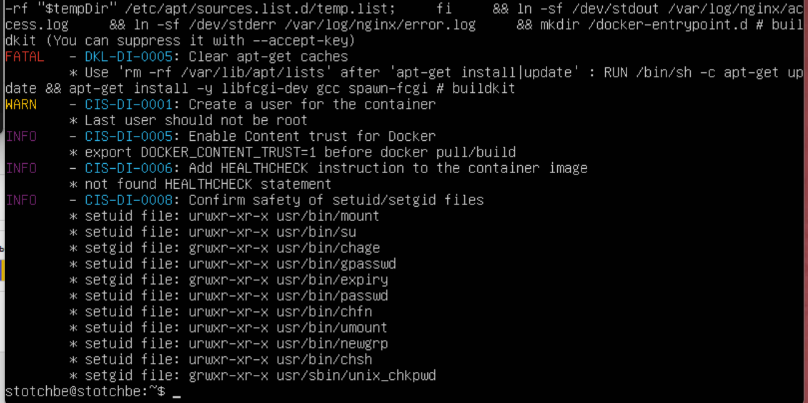

### Исправь образ так, чтобы при проверке через dockle не было ошибок и предупреждений
Исправление Dockerfile
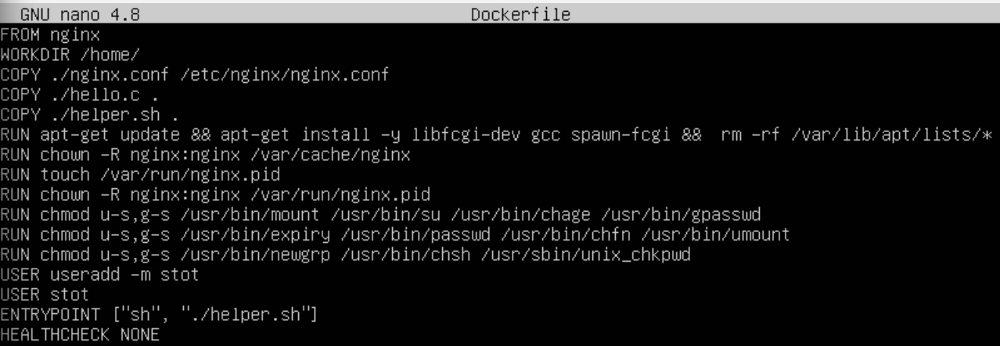

Запуск образа stotchbe:stot5
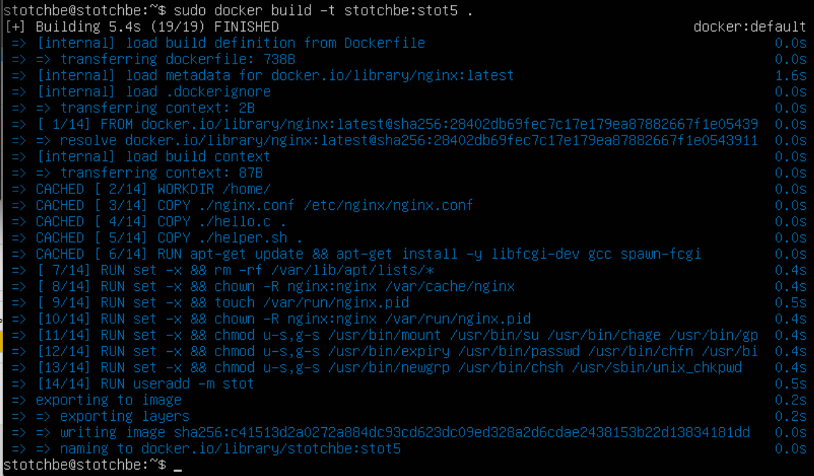

Образ без ошибок и предупреждений
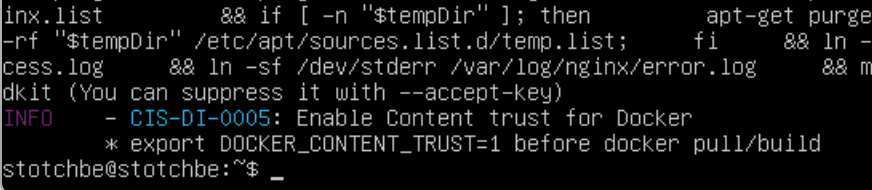

<h1 style="color: pink">Part 6. Базовый Docker Compose.</h1>

### Напиши файл docker-compose.yml, с помощью которого:

  <li>Подними докер-контейнер из Части 5 (он должен работать в локальной сети, т.е. не нужно использовать инструкцию EXPOSE и мапить порты на локальную машину)
  <li>запускает его на 8080 порту</li>
  <li>копирует внутрь образа написанный ./nginx/nginx.conf</li>
  <li>запускает nginx.</li>
  <li> 2) Подними докер-контейнер с nginx, который будет проксировать все запросы с 8080 порта на 81 порт первого контейнера</li>

  <li>Замапь 8080 порт второго контейнера на 80 порт локальной машины</li>
  
  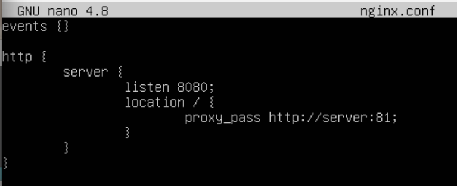
  
  <li>Останови все запущенные контейнеры</li>
  
  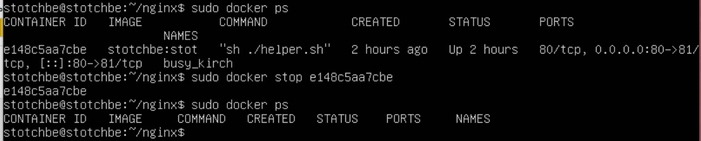
    
    Написанный docker-compose.yml 

   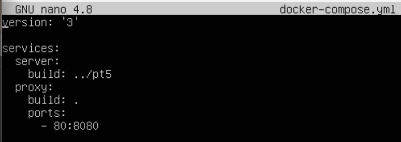

     sudo docker-compose build
   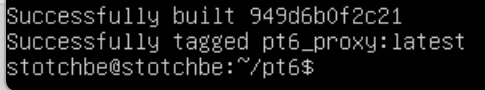

  <li>Собери и запусти проект с помощью команд docker-compose build и docker-compose up</li> 

   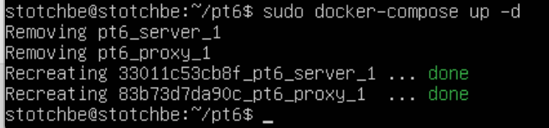
   
   <li>Проверь, что в браузере по localhost:80 отдается написанная тобой страничка, как и ранее</li>
   
   

