# Basic CI/CD
 

## Part 1. Настройка gitlab-runner
 

### Подними виртуальную машину Ubuntu Server 22.04 LTS.

Версия Ubuntu \
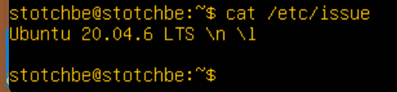
 

### Настройка и подготовка виртуальной машины

- Выключаем машину и включаем в настройках сети сетевой мост
- Подключаем адаптер 2 с типом подключения NAT
- Запускаем машину и смотрим выделеный IP-адрес коммандой ``ip addr``

IP-адрес - 192.168.1.29
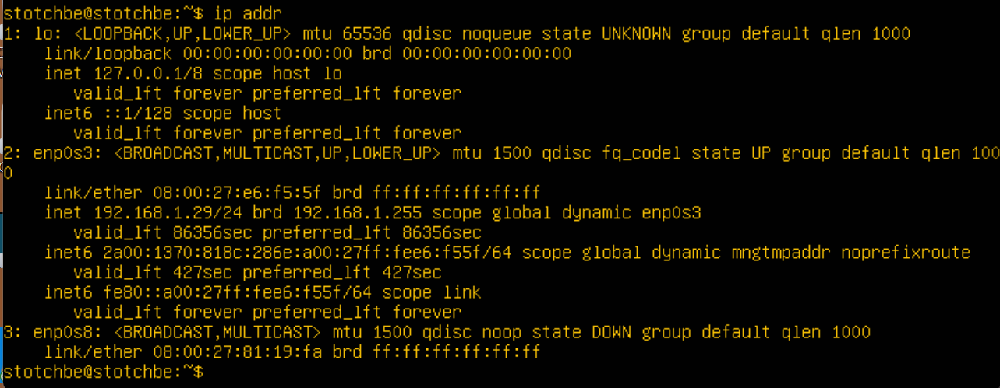
 

- Подключаемся к машине через терминал по SSH коммандой ``ssh stotchbe@192.168.1.29``

Подключение по ssh
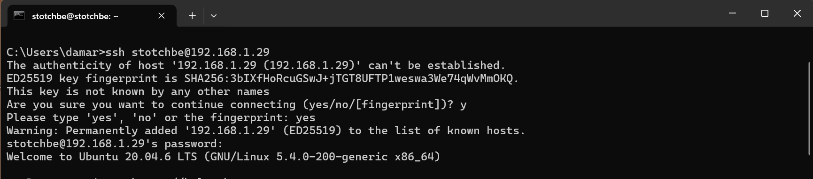
 

### Скачай и установи на виртуальную машину gitlab-runner.

- Скачаем и обновим пакеты "apt-get" командами:

    - ``sudo apt-get update``
    - ``sudo apt-get upgrade``

- Установка gitlab-runner, инструкция взята с официального сайта

  Установка пакетов gitlab-runner
  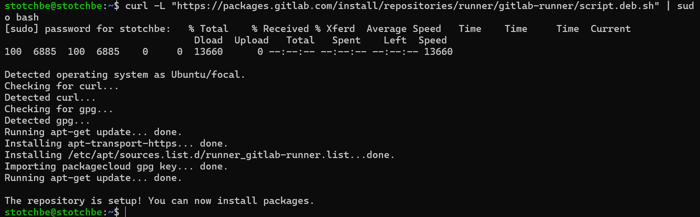
   
  Вводим команду ``sudo apt install gitlab-runner``
   

### Запусти gitlab-runner и зарегистрируй его для использования в текущем проекте (DO6_CICD). 

- Для регистрации понадобятся URL и токен, которые можно получить на страничке задания на платформе.
- Запустим сервис с помощью systemd и добавим его в автозагрузку ``sudo systemctl enable --now gitlab-runner``
- Регистрацию выполняем командой ``sudo gitlab-runner register``

Запуск и регистрация gitlab-runner
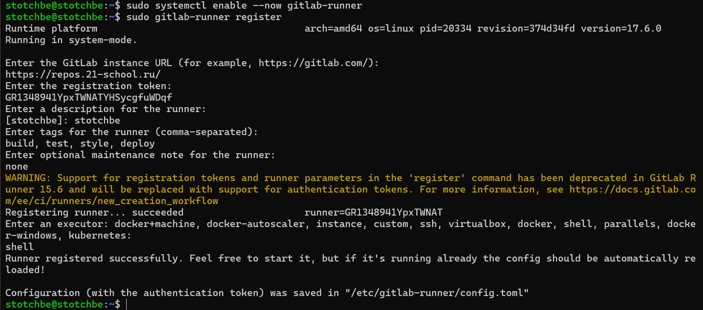
 

### Для корректной работы сервера так же установим "gcc" и "make"

 - Установка gcc коммандой ``sudo apt install gcc``, make коммандой ``sudo apt install make``

## Part 2. Сборка
 

### Напиши этап для CI по сборке приложений из проекта C2_SimpleBashUtils.

- Клонируем проект DO6_CICD с Gitlab
- Копируем папки cat, grep, for_test из проекта SimpleBashUtils
 

### В файле gitlab-ci.yml добавь этап запуска сборки через мейк файл из проекта C2.

### Файлы, полученные после сборки (артефакты), сохрани в произвольную директорию со сроком хранения 30 дней.

- Создаем файл gitlab-ci.yml в корне проекта

Содержимое файла gitlab-ci.yml \
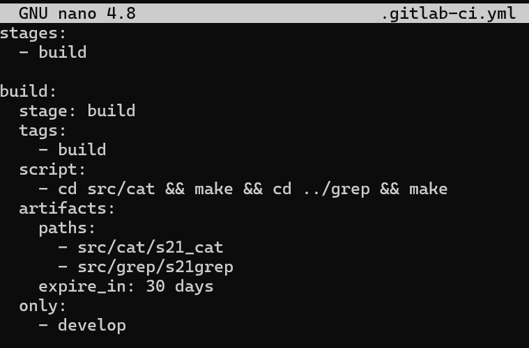
 

### Проверка сборки проекта

- С помощью утилиты "scp" скопируем проект на машину

Копируем проект коммандой ``scp -r DO6_CICD-3 stotchbe@192.168.1.29:/home/stotchbe/``
![файл gitlab-ci.yml(pics/2.3.jpg)
 

- Коммитим изменения и пушим на Gitlab

git init / git add / git commit
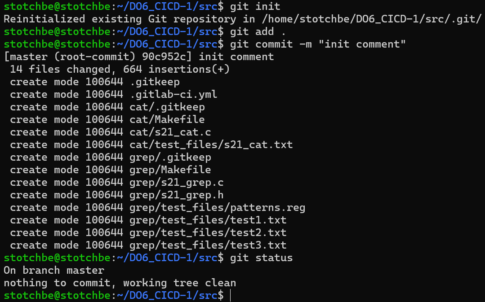
 

- Заходим на Gitlab в проект DO6_CICD во вкладку CI/CD и проверяем как отработал pipeline

Проверка pipeline

 

## Part 3. Тест кодстайла
 

### Напиши этап для CI, который запускает скрипт кодстайла (clang-format).

- Добавляем в .gitlab-ci.yml этап который запускает скрипт кодстайла 

Этап кодстайла\
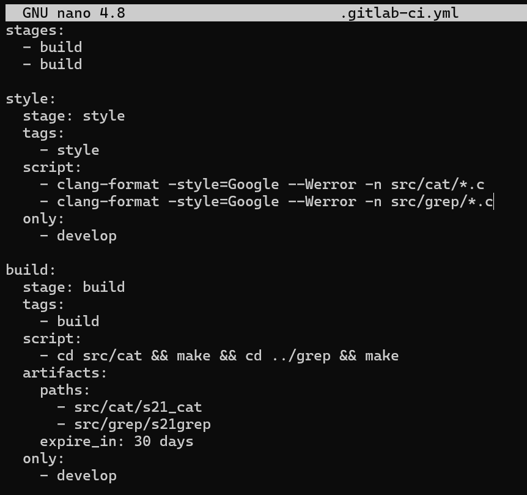
 

### Если кодстайл не прошел, то «зафейли» пайплайн.

- Проверяем что проект не прошел стадию style 

 

### В пайплайне отобрази вывод утилиты clang-format.

- Журнал пайплайна 

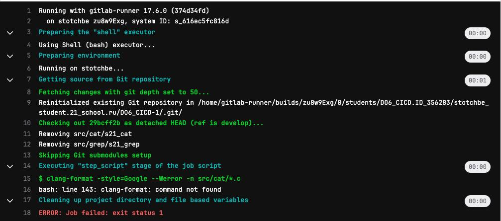
 

- Устанавливаем clang-format коммандой ``sudo apt install clang-format``

- Пройденный пайплайн 

 

## Part 4. Интеграционные тесты
 

### Напиши этап для CI, который запускает твои интеграционные тесты из того же проекта.

- Добавляем в .gitlab-ci.yml этап который запускает скрипт тестирования 

Этап тестирования \
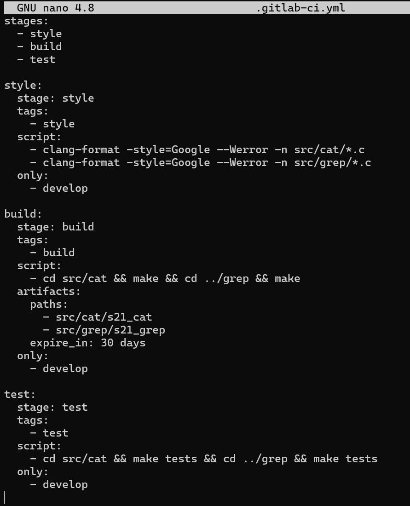
 

### Запусти этот этап автоматически только при условии, если сборка и тест кодстайла прошли успешно.

### Если тесты не прошли, то «зафейли» пайплайн.

- Все тесты прошли успешно

Этап тестирования

 

### В пайплайне отобрази вывод, что интеграционные тесты успешно прошли / провалились.

- Все тесты прошли успешно 

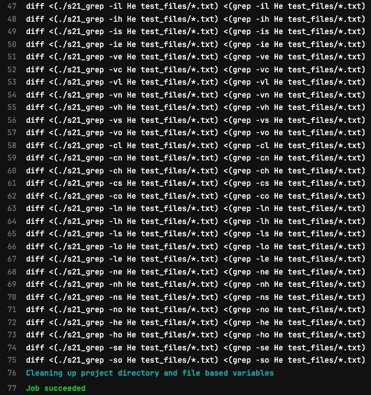
 

## Part 5. Этап деплоя
 

### Подними вторую виртуальную машину Ubuntu Server 22.04 LTS.

Подняли вторую виртуальную машину \
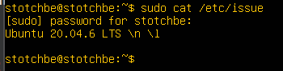
 

- Проверим соеденение между машинами

Первая виртуальная машина \
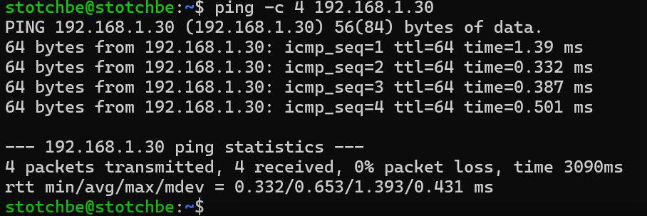
 

Вторая виртуальная машина \
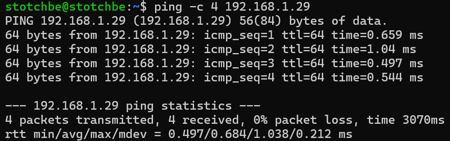
 

- Заходим под пользователем gitlab-runner коммандой ``sudo su gitlab-runner`` и генерируем ssh ключ

Сгенерированый ключ пользователем gitlab-runner
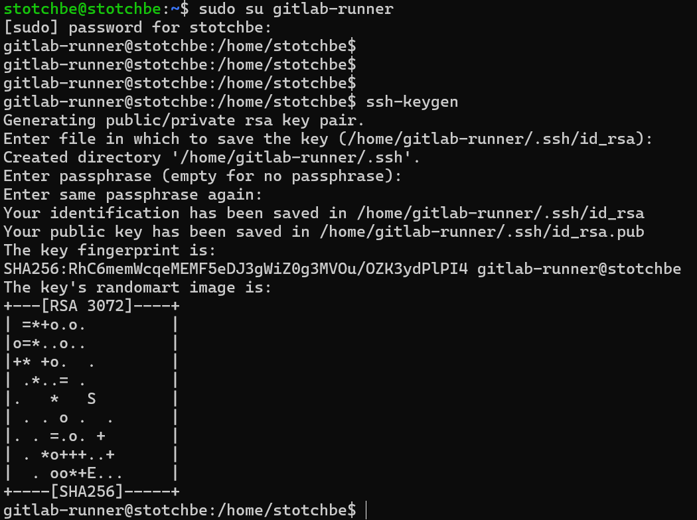
 

- С помощью комманды ``ssh-copy-id ws2@192.168.1.14`` переносим ключ на вторую машину. (ssh-copy-id — это утилита, которая помогает автоматически перенести значение публичного ключа на удалённый хост)

Перенос ключа на вторую машину
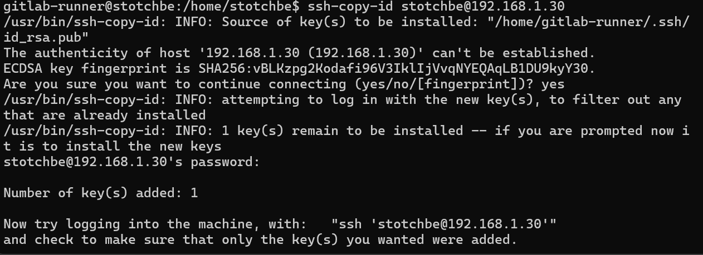
 

- Открываем файл конфигурации коммандой ``sudo vim /etc/ssh/sshd_config`` и меняем значение "PermitRootLogin" на "yes"

Файл конфигурации 
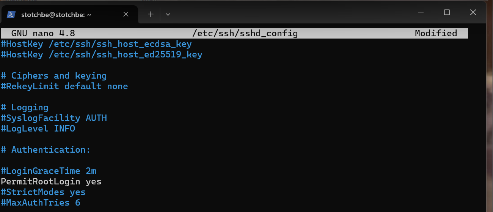
 

### Напиши этап для CD, который «разворачивает» проект на другой виртуальной машине.

- Запусти этот этап вручную при условии, что все предыдущие этапы прошли успешно.

  - Добавленно условие для запуска этапа вручную

Файл конфигурации \
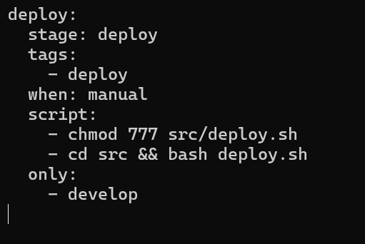
 

### Напиши bash-скрипт, который при помощи ssh и scp копирует файлы, полученные после сборки (артефакты), в директорию /usr/local/bin второй виртуальной машины.

- В файле gitlab-ci.yml добавь этап запуска написанного скрипта.

- В случае ошибки «зафейли» пайплайн.

Копирование файлов \
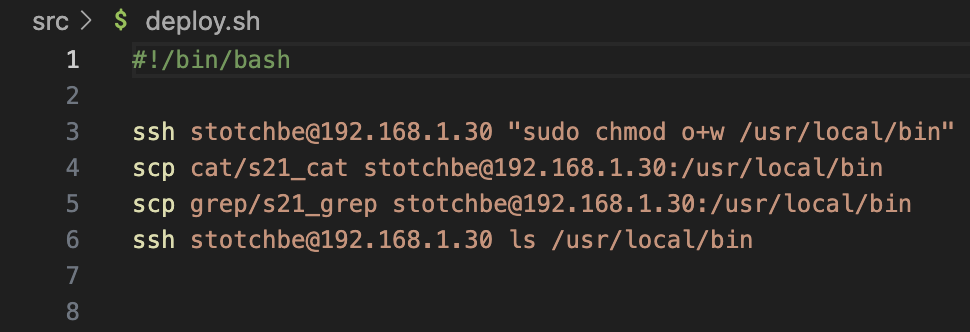
 

Для возможности добавления новых файлов выдали особые разрешения пользователю 
  ``sudo visudo`` \
В самый конец файла добавили строку \
  ``stotchbe ALL=(ALL) NOPASSWD: /bin/chmod, /bin/mv`` \

### В результате ты должен получить готовые к работе приложения из проекта C2_SimpleBashUtils (s21_cat и s21_grep) на второй виртуальной машине.

Готовые приложения на второй машине \
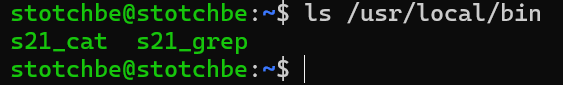
 

### Сохрани дампы образов виртуальных машин.

Дампы образов виртуальных машин \
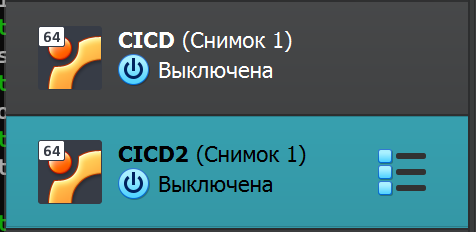
 

### Не забудь запустить пайплайн с последним коммитом в репозитории.

- Результат работы пайплайна

Запуск этапа вручную

 

## Part 6. Дополнительно. Уведомления

### Настрой уведомления об успешном/неуспешном выполнении пайплайна через бота с именем «[твой nickname] DO6 CI/CD» в Telegram.

- В телеграм ищем BotFater 
- Командой /newbot создаем бота
- Пишем имя бота в формате «[твой nickname] DO6 CI/CD»
- Получаем токен

Работа с BotFather \
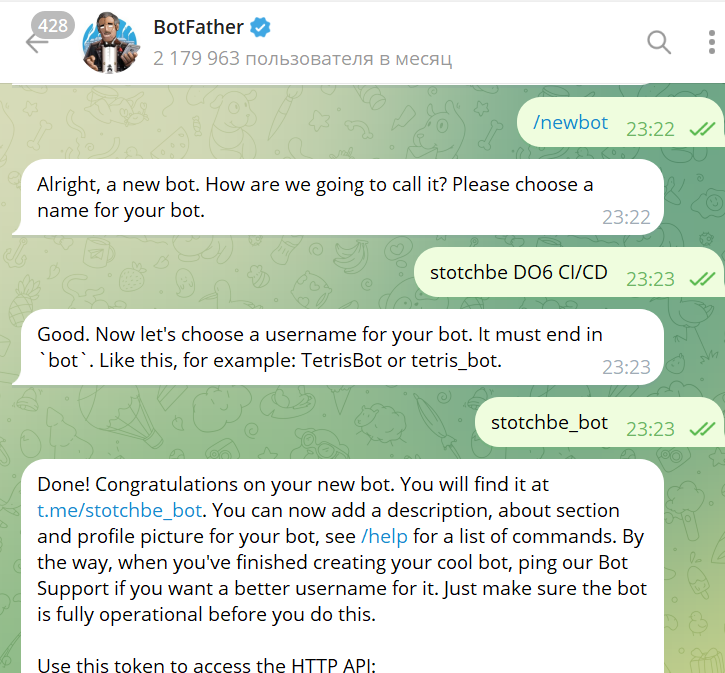
 

### Текст уведомления должен содержать информацию об успешности прохождения как этапа CI, так и этапа CD. В остальном текст уведомления может быть произвольным.

- Пишем скрипт для бота (за основу взят скрипт из materials/notifications_RUS.md)

Скрипт бота
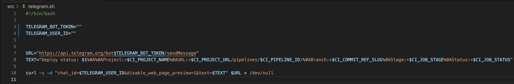
 

- Добавляем запуск скрипта после прохождения каждого этапа CI/CD

Файл конфигурации \
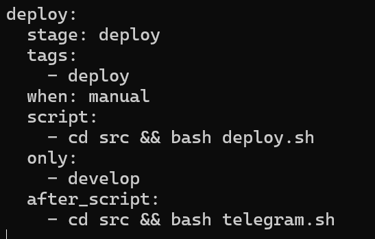
 

- Копируем проект на машину-сервер
- Делаем git commit/git push
- Получаем уведомления о прохождении этапов

Уведомления от бота \
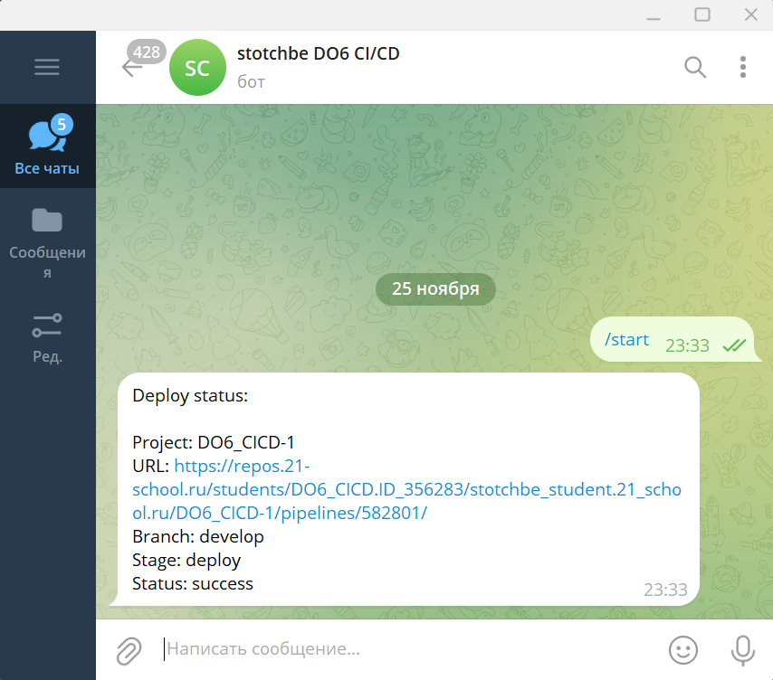
 

Пройденый пайплайн

 