# Task 1 — Authorization Test Cases (saucedemo.com)

## 1. Позитивный тест-кейс: успешная авторизация

### Шаги:
	1.	Открыть https://www.saucedemo.com/
	2.	Ввести логин: standard_user
	3.	Ввести пароль: secret_sauce
	4.	Нажать Login

Ожидаемый результат:
Пользователь попадает на страницу продуктов (Products).

Постусловия:
Отсутствуют.

Скриншоты:
### Скриншот 1.1 — До нажатия Login (валидные данные)
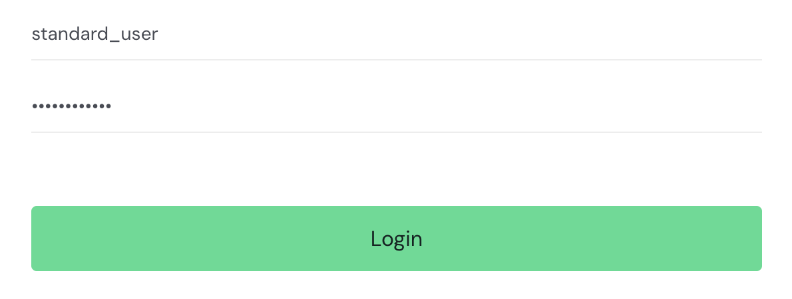

### Скриншот 1.2 — После успешной авторизации
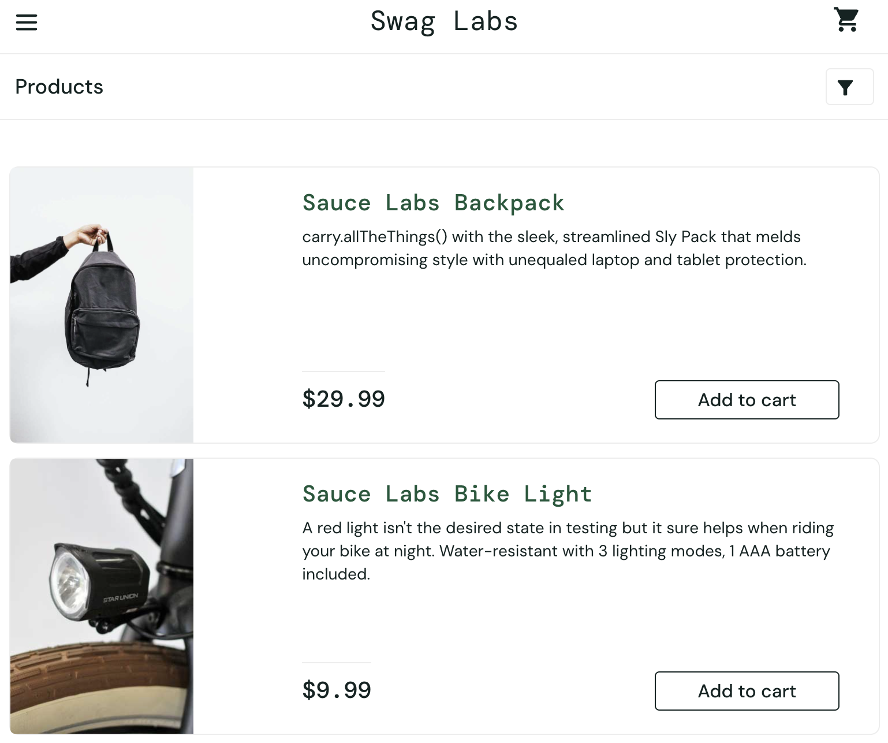

## 2. Негативный тест-кейс: неверный пароль

### Шаги:
	1.	Открыть https://www.saucedemo.com/
	2.	Ввести логин: standard_user
	3.	Ввести пароль: 12345
	4.	Нажать Login

Ожидаемый результат:
Отображается сообщение об ошибке.

Постусловия:
Отсутствуют.

Скриншоты:
### Скриншот 1.3 — До нажатия Login (неверный пароль)
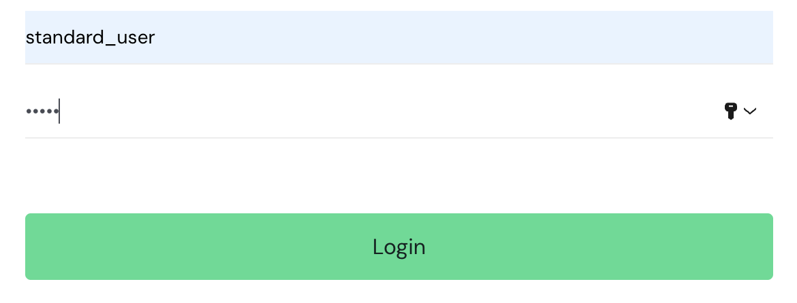

### Скриншот 1.4 — Ошибка при неверном пароле
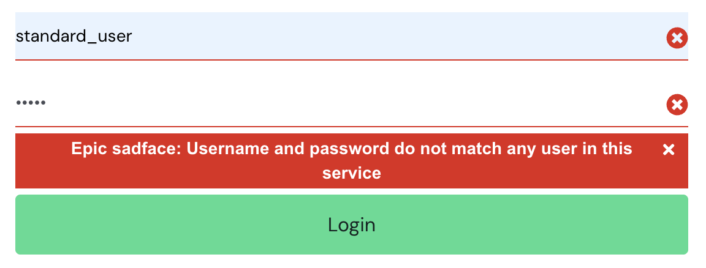

## 3. Негативный тест-кейс: неверный логин

### Шаги:
	1.	Открыть https://www.saucedemo.com/
	2.	Ввести логин: standard_users
	3.	Ввести пароль: secret_sauce
	4.	Нажать Login

Ожидаемый результат:
Отображается сообщение об ошибке.

Постусловия:
Отсутствуют.

Скриншоты:
### Скриншот 1.5 — До нажатия Login (невалидный логин)
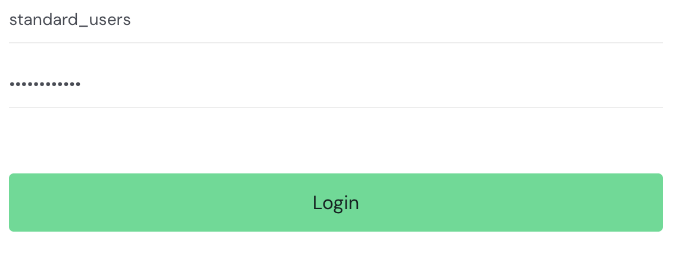

### Скриншот 1.6 — Ошибка при невалидном логине
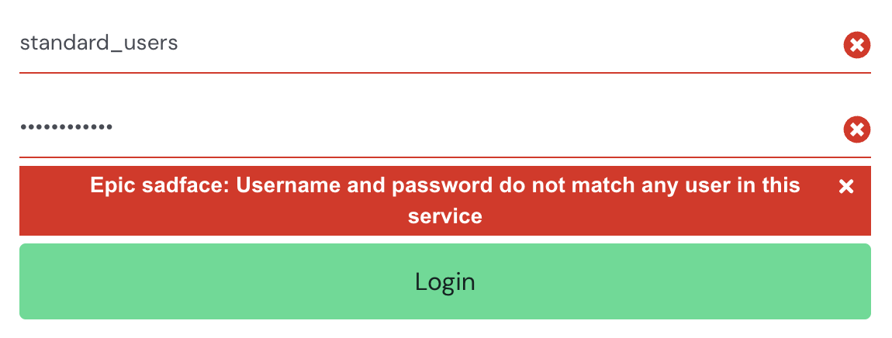

## 4. Негативный тест-кейс: пустой логин

### Шаги:
	1.	Открыть https://www.saucedemo.com/
	2.	Логин оставить пустым
	3.	Ввести пароль: secret_sauce
	4.	Нажать Login

Ожидаемый результат:
Отображается сообщение о том, что логин обязателен.

Постусловия:
Отсутствуют.

Скриншоты:
### Скриншот 1.7 — До нажатия Login (пустой логин)
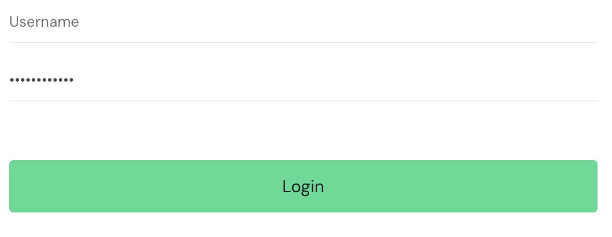

### Скриншот 1.8 — Ошибка при пустом логине
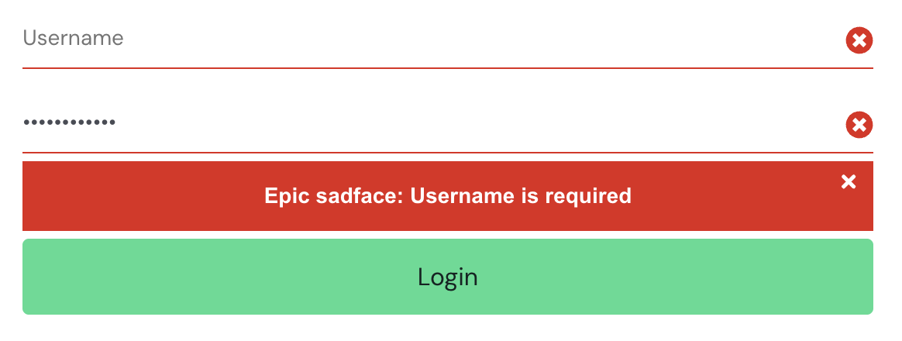

## 5. Негативный тест-кейс: пустые оба поля

### Шаги:
	1.	Открыть https://www.saucedemo.com/
	2.	Оставить логин пустым
	3.	Оставить пароль пустым
	4.	Нажать Login

Ожидаемый результат:
Отображается сообщение об ошибке.

Постусловия:
Отсутствуют.

Скриншоты:
### Скриншот 1.9 — До нажатия Login (оба поля пустые)
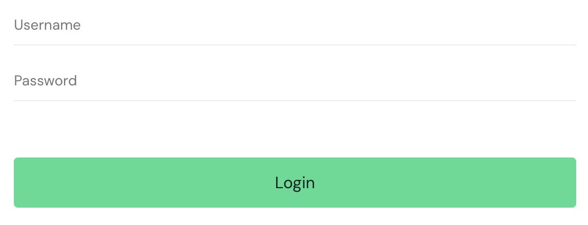

### Скриншот 1.10 — Ошибка при пустых обоих полях
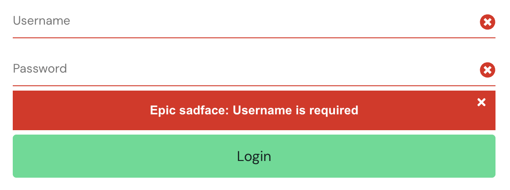

## 6. Негативный тест-кейс: пустой пароль

### Шаги:
	1.	Открыть https://www.saucedemo.com/
	2.	Ввести логин: standard_user
	3.	Пароль оставить пустым
	4.	Нажать Login

Ожидаемый результат:
Отображается сообщение об ошибке.

Постусловия:
Отсутствуют.

Скриншоты:
### Скриншот 1.11 — До нажатия Login (пустой пароль)
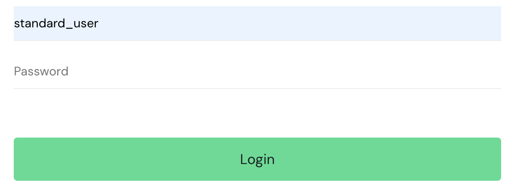

### Скриншот 1.12 — Ошибка при пустом пароле
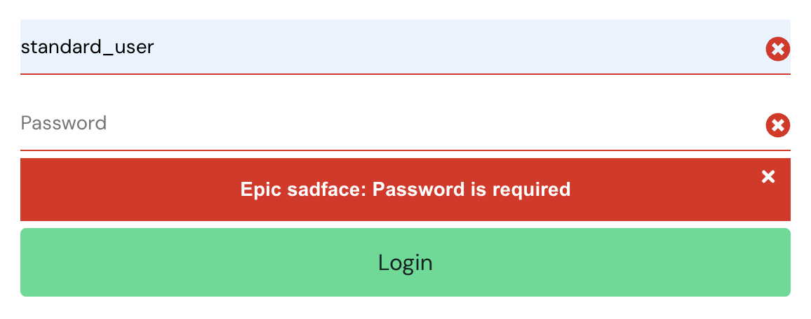