# Task 4 — Тестовые данные

## Два ресурса для генерации файлов

1. https://randvar.com/generator/file

### Скриншот 5.1 — Форма заполнения данных о картинке для генерации (позитивный тест)
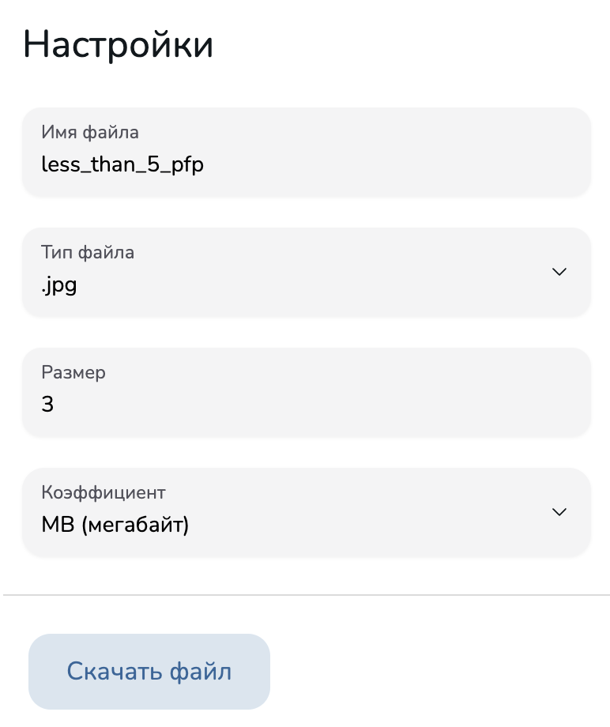

### Скриншот 5.2 — Загруженный файл
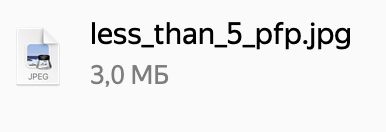

### Скриншот 5.3 — Форма заполнения данных о картинке для генерации (негативный тест)
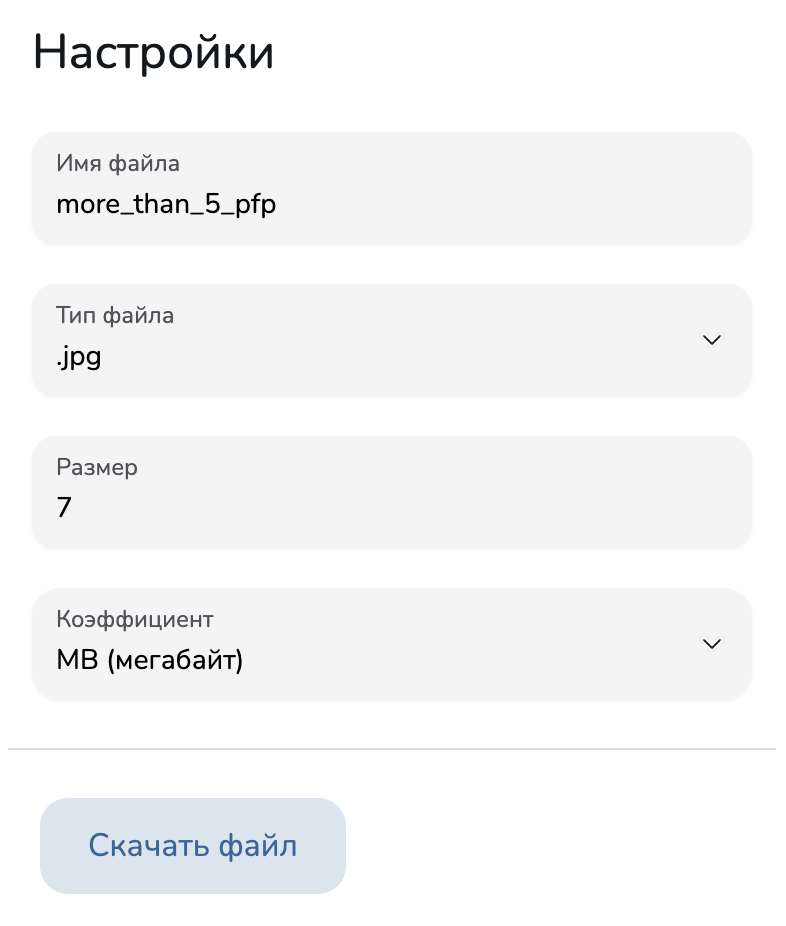

### Скриншот 5.4 — Загруженный файл
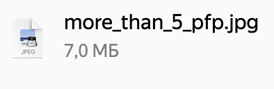

### Скриншот 5.5 — Форма заполнения данных о картинке для генерации (позитивный тест)
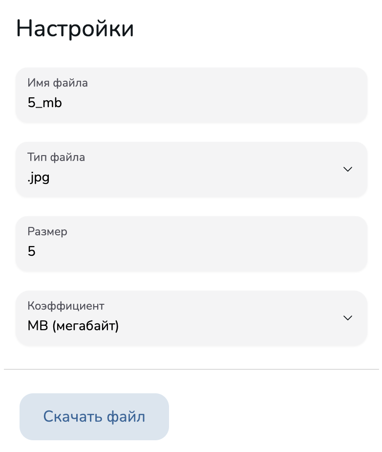

### Скриншот 5.6 — Загруженный файл
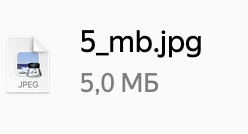

2. https://file.generator.teremokgames.com/

### Скриншот 5.7 — Форма заполнения данных о картинке для генерации (позитивный тест)
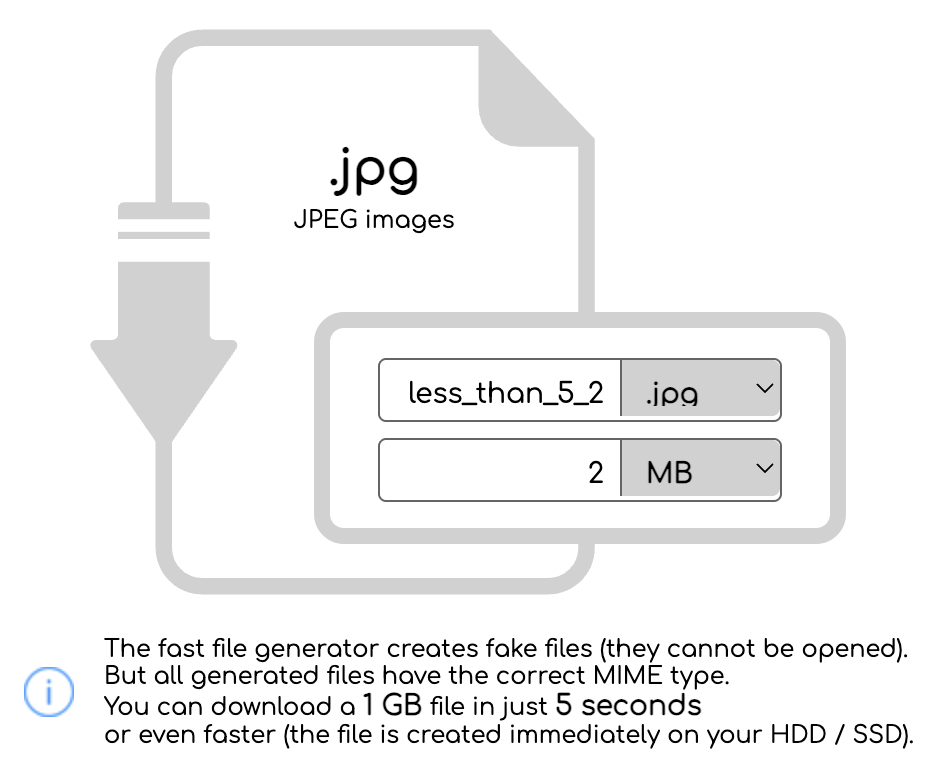

### Скриншот 5.8 — Загруженный файл
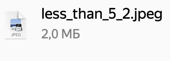

### Скриншот 5.9 — Форма заполнения данных о картинке для генерации (негативный тест)
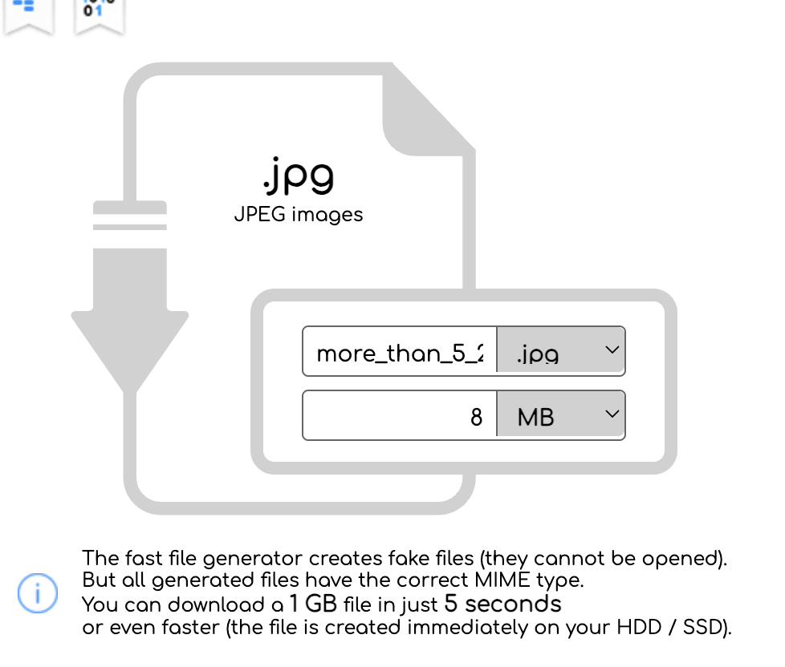

### Скриншот 5.10 — Загруженный файл
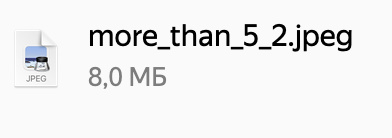

### Скриншот 5.11 — Форма заполнения данных о картинке для генерации (позитивный тест)
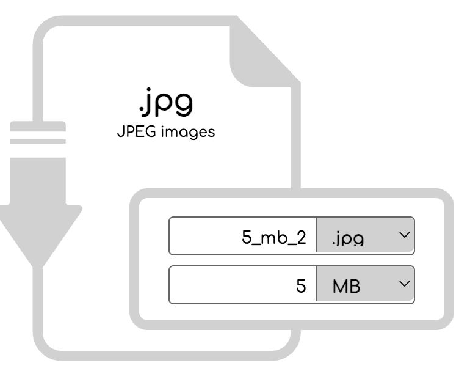

### Скриншот 5.12 — Загруженный файл
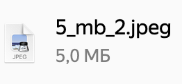

## Два ресурса для генерации тестовых данных

1. https://www.fakenamegenerator.com/gen-random-us-us.php

### Скриншот 5.13 — Форма выбора данных для генерации
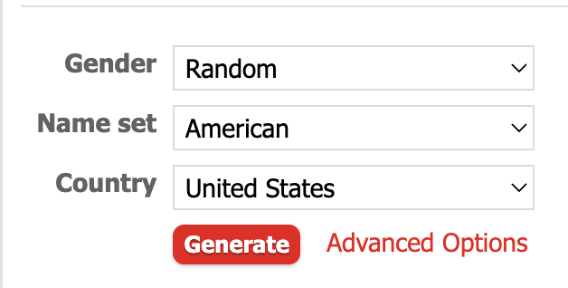

### Скриншот 5.14 — Сгенерированный человек №1
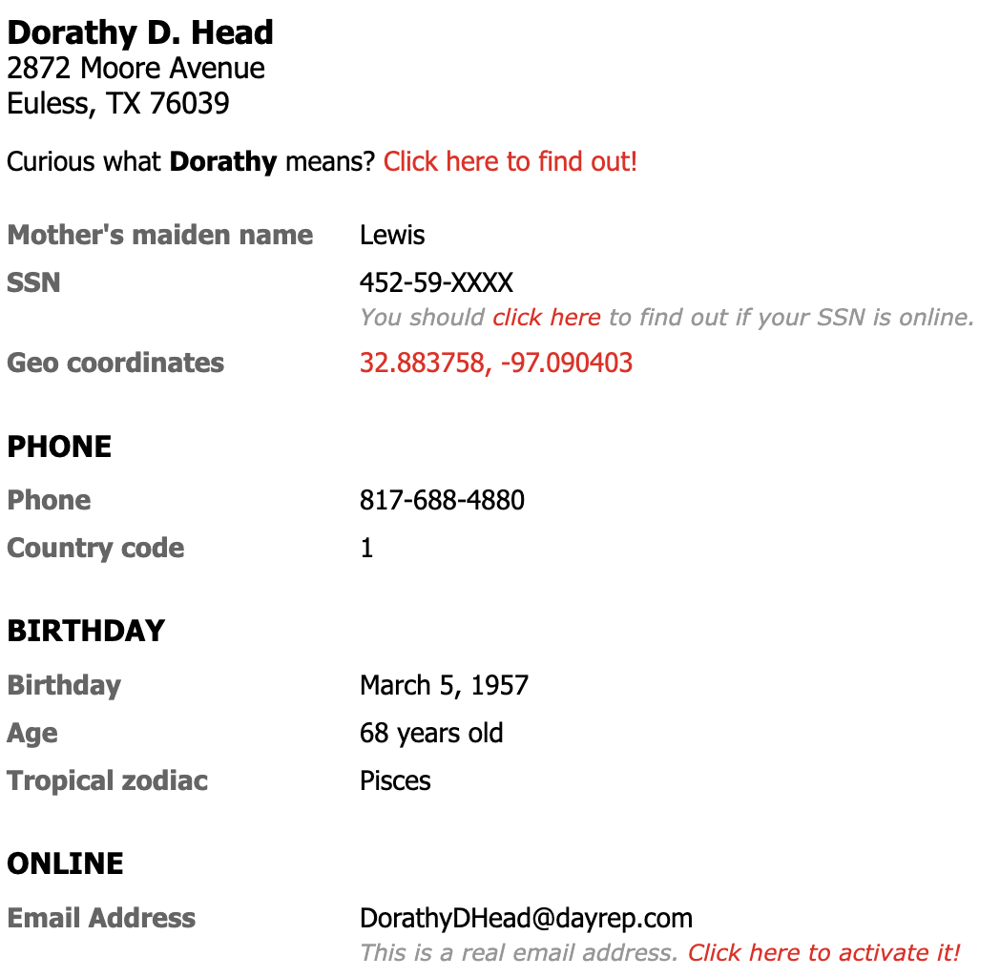

Телефон
817 — валидный area code
соответствует штату Texas
формат корректен

Адрес
TX — Texas
ZIP 76039 — соответствует штату Texas

### Скриншот 5.15 — Сгенерированный человек №2
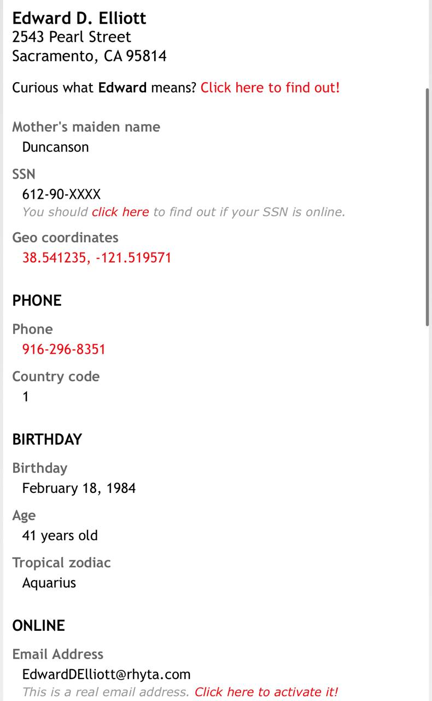

Телефон
916 — валидный (код +1)
формат корректен 

Адрес
CA — California
ZIP 95814 — соответствует штату California

### Скриншот 5.16 — Сгенерированный человек №3
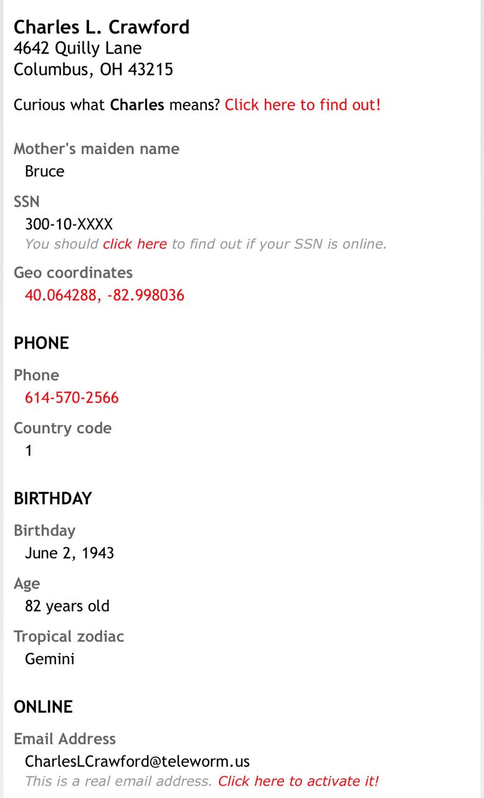

Телефон
614 — валидный (код +1)
формат корректен 

Адрес
OH — Ohio
ZIP 43215 — соответствует штату Ohio

### Скриншот 5.17 — Сгенерированный человек №4
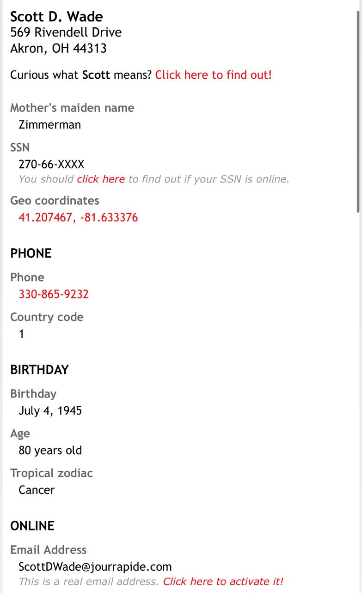

Телефон
916 — валидный (код +1)
формат корректен 

Адрес
CA — California
ZIP 95814 — соответствует штату California (Sacramento)

### Скриншот 5.18 — Сгенерированный человек №5
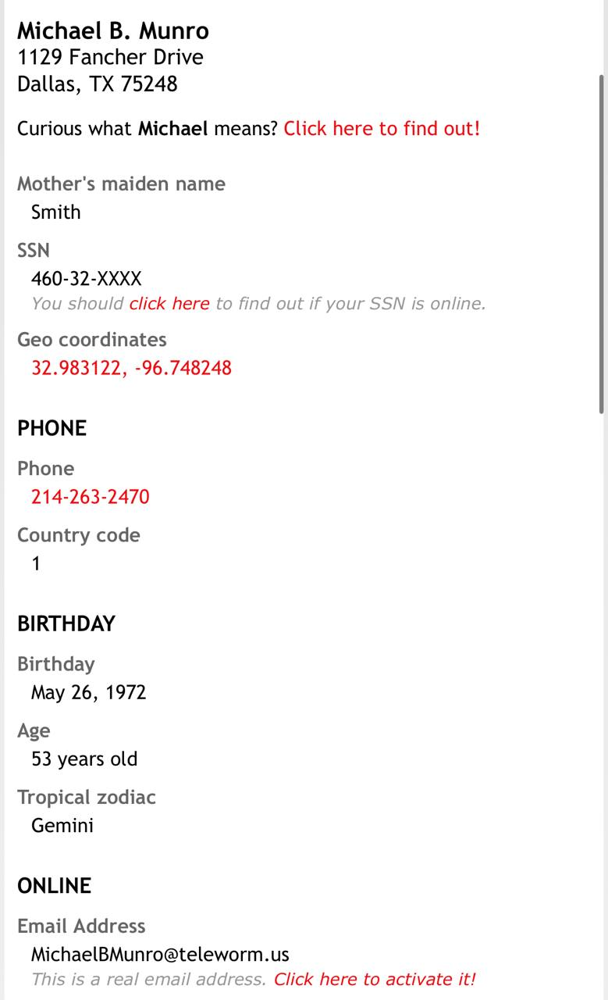

Телефон
330 — валидный (код +1)
формат корректен 

Адрес
OH — Ohio
ZIP 44313 — соответствует штату Ohio

2. https://www.onlinewebtoolkit.com/generatedata#

### Скриншот 5.19 — Форма выбора данных для генерации
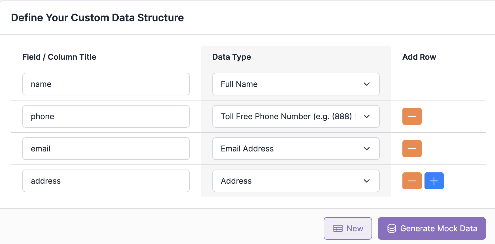

    name,phone,email,address
    "Lindsay Kovacek",1-855-896-2726,janessa07@mayert.com,"407 Justus Manor
    Gulgowskichester, NJ 90296"

Телефон
855 — валидный toll-free
формат корректен

Адрес
NJ — New Jersey 
ZIP 90296 — California, а не NJ

    "Celine Hand",888.719.5822,naomie74@nolan.com,"972 Elyssa Mount
    New Sethport, LA 80146-6534"

Телефон
888 — валидный toll-free 
формат допустим 

Адрес
LA — Louisiana 
ZIP 80146 — Colorado, не Louisiana

    "Zaria Haag",855-486-7557,wohara@schneider.info,"834 Ana Lights Apt. 311
    Royton, VT 83355"

Телефон
855 — валидный toll-free 
формат корректен 

Адрес
VT — Vermont 
ZIP 83355 — Idaho, не Vermont

    "Otis Kuphal DVM",1-800-409-0764,steuber.billy@monahan.org,"29835 Nikolaus Wall
    East Sadyeborough, MA 37349-3571"

Телефон
800 — валидный toll-free 
формат корректен 

Адрес
MA — Massachusetts 
ZIP 37349 — Tennessee, не Massachusetts

    "Prof. Toney Heller Sr.",800-945-2211,llueilwitz@gmail.com,"2815 Otilia Ridges Apt. 641
    New Leo, OH 34175"

Телефон
800 — валидный 
формат корректен 

Адрес
OH — Ohio 
ZIP 34175 — Florida, не Ohio